# System Architecture Overview

**Navigation:** [Documentation Home](../README.md) > [Architecture](./README.md) > Overview

---

## Table of Contents

- [Introduction](#introduction)
- [Component Architecture](#component-architecture)
- [Core Components](#core-components)
- [Key Interfaces and Classes](#key-interfaces-and-classes)
- [Package Structure](#package-structure)
- [Module Dependencies](#module-dependencies)
- [Design Principles](#design-principles)
- [Core Concepts and Relationships](#core-concepts-and-relationships)
- [Execution Flow](#execution-flow)
- [Thread Safety and Concurrency](#thread-safety-and-concurrency)
- [Extension Points](#extension-points)

---

## Introduction

Judo Zeta is a **lightweight, standalone validation framework for EMF metamodels**. It provides a modern, annotation-based alternative to Epsilon Validation Language (EVL) with parallel execution, dependency resolution, and comprehensive caching support.

The framework is designed with the following goals:

- **Simplicity:** Write validation rules as plain Java methods with annotations
- **Performance:** Automatic parallel execution for large models (5000+ elements)
- **Type Safety:** Compile-time validation rule checking via Java's type system
- **Flexibility:** Support for guards, dependencies, caching, and extension methods
- **Modularity:** Clean separation between core framework and metamodel-specific implementations

---

## Component Architecture

The following diagram illustrates the high-level architecture and component relationships:

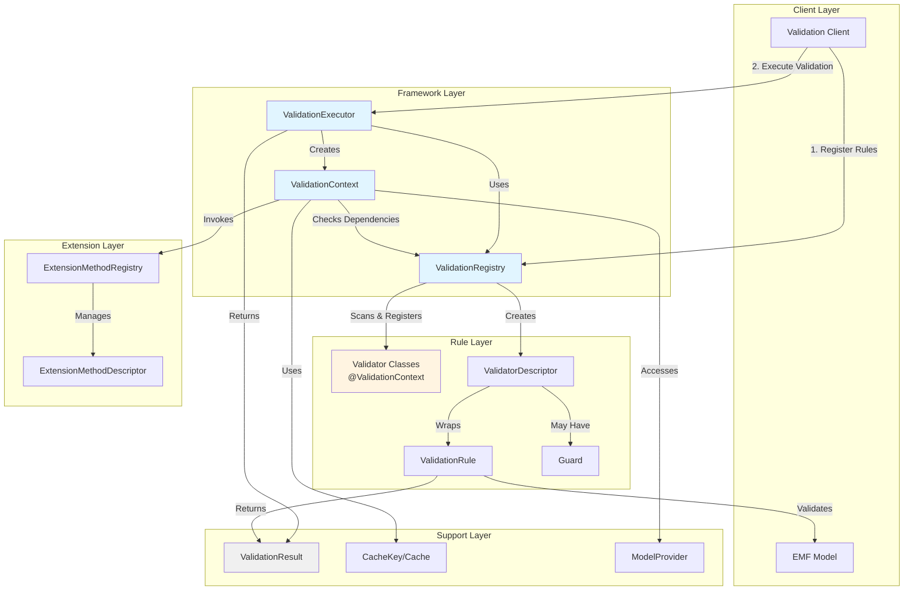

### Component Interaction Flow

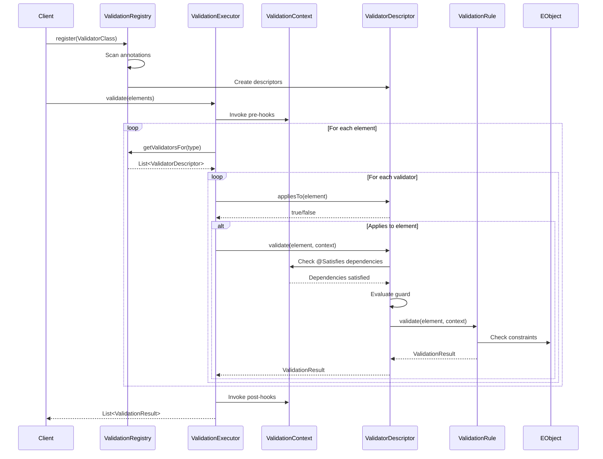

---

## Core Components

### 1. ValidationRegistry

**Purpose:** Central registry for discovering, registering, and managing validation rules.

**Responsibilities:**
- Scan classes annotated with `@ValidationContext`
- Register constraint and critique methods as validation rules
- Create and manage `ValidatorDescriptor` instances
- Provide validators by element type (including type hierarchy)
- Manage pre/post-validation lifecycle hooks

**Key Features:**
- Type-based rule lookup with inheritance support
- Interface-aware validation (checks all implemented interfaces)
- Named validator lookup for dependency resolution
- Thread-safe registration

### 2. ValidationExecutor

**Purpose:** Parallel execution engine for running validation rules against model elements.

**Responsibilities:**
- Orchestrate validation execution (sequential or parallel)
- Determine optimal execution strategy based on element count
- Partition work into chunks for parallel processing
- Invoke lifecycle hooks (pre/post-validation)
- Filter and return only failed validation results

**Key Features:**
- Automatic parallel execution for 5000+ elements
- Work-stealing thread pool (ForkJoinPool)
- Configurable chunk size (default: 100 elements per chunk)
- Validator cache pre-computation for performance
- Lazy executor initialization

### 3. ValidationContext

**Purpose:** Runtime context providing access to model, cache, and extension methods during validation.

**Responsibilities:**
- Track current element being validated (thread-local)
- Provide model traversal via `ModelProvider`
- Manage `@Satisfies` dependency cache
- Invoke extension methods with caching
- Store custom attributes for hooks

**Key Features:**
- Thread-safe current element tracking (ThreadLocal)
- Circular dependency detection for `@Satisfies`
- Three-state cache (EVALUATING, SATISFIED, NOT_SATISFIED)
- Extension method invocation with result caching
- Custom attribute storage for inter-hook communication

### 4. ValidatorDescriptor

**Purpose:** Metadata wrapper for a single validation rule.

**Responsibilities:**
- Store rule metadata (name, message, severity, context type)
- Cache `ValidationRule` and `Guard` instances
- Check if rule applies to an element type
- Validate elements with guard and dependency checking
- Interpolate message placeholders

**Key Features:**
- Lazy initialization of rule and guard instances
- Reflection-based method invocation
- Guard evaluation before rule execution
- `@Satisfies` dependency enforcement
- Message interpolation (`{element.name}`)

### 5. ValidationRule (Functional Interface)

**Purpose:** Functional interface representing a single validation rule.

**Signature:**
```java
@FunctionalInterface
public interface ValidationRule {
    ValidationResult validate(EObject element, ValidationContext ctx);
}
```

**Usage:**
- Enables lambda-based rule definition
- Receives element and context
- Returns `ValidationResult` (pass/fail)
- Compose-able via functional programming

### 6. ValidationResult (Immutable Value Object)

**Purpose:** Immutable result representing validation outcome.

**Properties:**
- `boolean passed` - Whether validation passed
- `String constraintName` - Name of the constraint
- `String message` - Error/warning message
- `Severity severity` - ERROR or WARNING
- `EObject context` - Element that failed validation

**Factory Methods:**
- `ValidationResult.pass()` - Create passing result
- `ValidationResult.fail(message)` - Create error result
- `ValidationResult.warn(message)` - Create warning result
- `ValidationResult.fail(name, message, severity, element)` - Full metadata

---

## Key Interfaces and Classes

### Interface Hierarchy

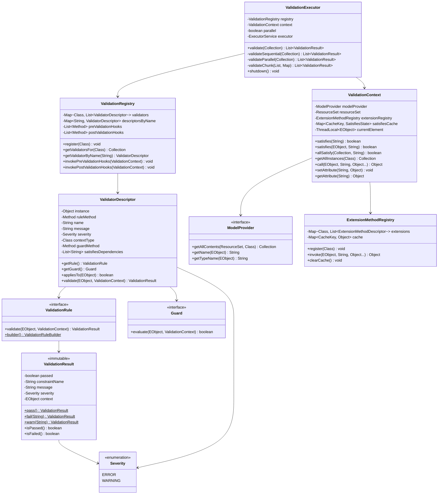

### Annotation System

```mermaid
classDiagram
    class ValidationContext {
        <<annotation>>
        +Class~EObject~ value
    }

    class Constraint {
        <<annotation>>
        +String name
        +String message
    }

    class Critique {
        <<annotation>>
        +String name
        +String message
    }

    class Guard {
        <<annotation>>
        +String method
    }

    class Satisfies {
        <<annotation>>
        +String[] constraints
    }

    class Cached {
        <<annotation>>
    }

    class ExtensionMethod {
        <<annotation>>
        +Class~EObject~ elementType
    }

    class PreValidation {
        <<annotation>>
    }

    class PostValidation {
        <<annotation>>
    }

    note for ValidationContext "Marks class as containing\nvalidation rules for a type"
    note for Constraint "Defines ERROR-level rule"
    note for Critique "Defines WARNING-level rule"
    note for Guard "Conditional execution guard"
    note for Satisfies "Declares rule dependencies"
    note for Cached "Enables result caching"
    note for ExtensionMethod "Registers helper method"
    note for PreValidation "Pre-validation lifecycle hook"
    note for PostValidation "Post-validation lifecycle hook"
```

---

## Package Structure

```
hu.blackbelt.judo.zeta.validation
├── ModelProvider.java                      # Core metamodel integration interface
│
├── annotation/                             # Annotation definitions
│   ├── Constraint.java                    # @Constraint - Error-level rule
│   ├── Critique.java                      # @Critique - Warning-level rule
│   ├── Guard.java                         # @Guard - Conditional execution
│   ├── Satisfies.java                     # @Satisfies - Rule dependencies
│   ├── Cached.java                        # @Cached - Result caching
│   ├── ExtensionMethod.java               # @ExtensionMethod - Helper methods
│   ├── PreValidation.java                 # @PreValidation - Pre-hook
│   ├── PostValidation.java                # @PostValidation - Post-hook
│   └── ValidationContext.java             # @ValidationContext - Rule container
│
├── core/                                   # Core validation engine
│   ├── ValidationRegistry.java            # Rule registration and discovery
│   ├── ValidationExecutor.java            # Parallel execution engine
│   ├── ValidationContext.java             # Runtime execution context
│   ├── ValidationResult.java              # Immutable result value object
│   ├── ValidationRule.java                # Functional interface for rules
│   ├── ValidationRuleBuilder.java         # Fluent builder API
│   ├── ValidatorDescriptor.java           # Rule metadata wrapper
│   ├── ExtensionMethodRegistry.java       # Extension method management
│   ├── ExtensionMethodDescriptor.java     # Extension method metadata
│   ├── CacheKey.java                      # Immutable cache key
│   ├── CacheKeyBuilder.java               # Cache key construction
│   ├── Guard.java                         # Guard functional interface
│   └── Severity.java                      # ERROR/WARNING enumeration
│
└── util/                                   # Utility classes
    └── EolStyleCollections.java           # Epsilon-like collection utilities
```

### Package Responsibilities

| Package | Responsibility | Public API |
|---------|---------------|------------|
| `validation` | Core integration interface | `ModelProvider` |
| `validation.annotation` | Validation DSL annotations | All 8 annotations |
| `validation.core` | Validation engine implementation | All core classes |
| `validation.util` | Utility classes | `EolStyleCollections` |

---

## Module Dependencies

The project consists of three modules with the following dependency structure:

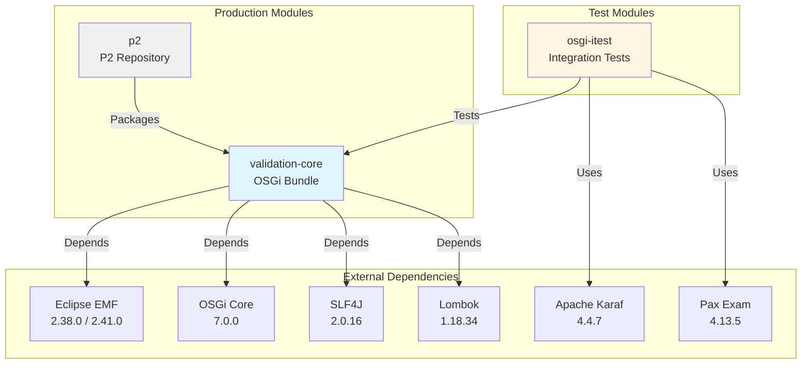

### Module Details

**validation-core** (`hu.blackbelt.judo.zeta.validation-core`)
- Type: OSGi Bundle
- Purpose: Reusable validation framework
- Key Dependencies: EMF Ecore, SLF4J, Lombok
- Exports: All public packages

**p2** (`hu.blackbelt.judo.zeta.p2`)
- Type: P2 Repository
- Purpose: Eclipse P2 update site packaging
- Packages: validation-core as Eclipse feature

**osgi-itest** (`hu.blackbelt.judo.zeta.osgi.itest`)
- Type: Integration Test Suite
- Purpose: OSGi/Karaf integration testing
- Framework: Pax Exam 4.13.5
- Runtime: Apache Karaf 4.4.7

### External Dependencies

| Dependency | Version | Scope | Purpose |
|------------|---------|-------|---------|
| Eclipse EMF Ecore | 2.38.0 / 2.41.0 | compile | Metamodel foundation |
| OSGi Core | 7.0.0 | provided | OSGi framework APIs |
| SLF4J API | 2.0.16 | compile | Logging facade |
| Logback | 1.5.12 | test | Logging implementation |
| Lombok | 1.18.34 | provided | Annotation processing |
| JUnit Jupiter | 5.11.3 | test | Unit testing |
| Apache Karaf | 4.4.7 | test | OSGi runtime |
| Pax Exam | 4.13.5 | test | OSGi integration testing |

---

## Design Principles

### 1. Annotation-Driven Configuration

The framework uses annotations as a declarative DSL for defining validation rules, eliminating the need for external configuration files or domain-specific languages like EVL.

**Benefits:**
- Compile-time validation of rule definitions
- IDE support (autocomplete, refactoring, navigation)
- Type-safe rule implementation
- No external file parsing or interpretation

**Example:**
```java
@ValidationContext(EntityType.class)
public class EntityTypeValidations {
    @Constraint(name = "EntityMustHaveName", message = "Entity must have name")
    public ValidationRule entityMustHaveName() {
        return (element, ctx) -> { /* ... */ };
    }
}
```

### 2. Functional Programming

The framework embraces functional programming principles through the use of functional interfaces and lambda expressions.

**Key Functional Interfaces:**
- `ValidationRule` - Rule logic as function
- `Guard` - Conditional predicate
- Immutable results and cache keys

**Benefits:**
- Concise rule definitions
- Composable validation logic
- Stateless rule execution
- Easy testing and reasoning

**Example:**
```java
ValidationRule rule = (element, ctx) -> {
    return condition(element) 
        ? ValidationResult.pass() 
        : ValidationResult.fail("Error");
};
```

### 3. Immutability

Core value objects are immutable to ensure thread safety and prevent unexpected side effects.

**Immutable Classes:**
- `ValidationResult` - Validation outcome
- `CacheKey` - Cache key for results
- All annotation metadata

**Benefits:**
- Thread-safe sharing across parallel workers
- No defensive copying needed
- Clear value semantics
- Safer caching strategies

### 4. Separation of Concerns

The architecture cleanly separates different concerns:

| Concern | Component | Responsibility |
|---------|-----------|---------------|
| Rule Discovery | `ValidationRegistry` | Scan and register rules |
| Rule Execution | `ValidationExecutor` | Execute rules in parallel |
| Runtime Context | `ValidationContext` | Provide access to model and cache |
| Rule Metadata | `ValidatorDescriptor` | Store rule metadata |
| Rule Logic | `ValidationRule` | Implement validation logic |
| Model Access | `ModelProvider` | Abstract model traversal |

### 5. Type Safety

The framework leverages Java's type system for compile-time safety:

- Generic type parameters preserve element types
- Reflection used only for discovery, not execution
- Metamodel classes are strongly typed EMF classes
- No string-based element access in rules

### 6. Performance by Default

Performance optimizations are built-in and automatic:

- **Parallel Execution:** Automatic for 5000+ elements
- **Lazy Initialization:** Executors created only when needed
- **Result Caching:** `@Cached` annotation for expensive operations
- **Pre-computation:** Validator lookups cached before parallel execution
- **Efficient Chunking:** Work divided evenly across CPU cores

### 7. Extensibility

The framework provides multiple extension points:

- **ModelProvider:** Integrate any EMF metamodel
- **Extension Methods:** Add reusable helper functions
- **Pre/Post Hooks:** Lifecycle callbacks for setup/teardown
- **Guard Functions:** Custom conditional logic
- **Custom Attributes:** Inter-hook communication via context

---

## Core Concepts and Relationships

### Validation Rule Lifecycle

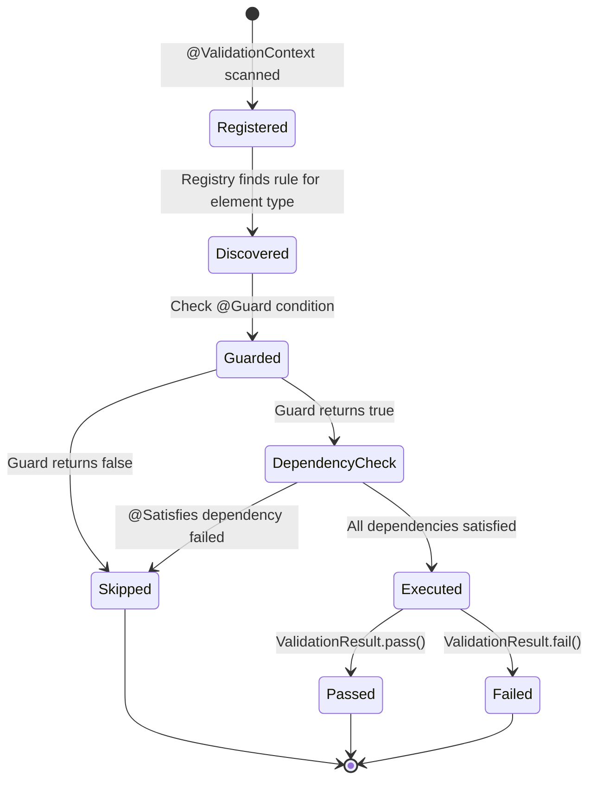

### Dependency Resolution

The framework resolves `@Satisfies` dependencies at runtime through a cache-based approach:

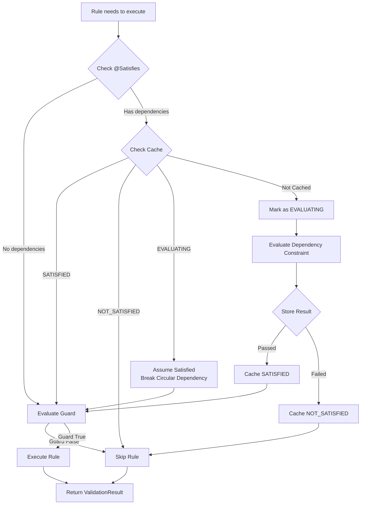

### Caching Strategy

The framework supports multiple caching levels:

**1. Satisfies Cache (Automatic)**
- Caches constraint satisfaction results
- Three states: EVALUATING, SATISFIED, NOT_SATISFIED
- Prevents re-evaluation of the same constraint
- Clears after validation run

**2. Extension Method Cache (Annotation-based)**
- Enabled via `@Cached` annotation
- Cache key: `(element, methodName, args)`
- Stores expensive computation results
- Clears after validation run

**3. Validator Cache (Performance Optimization)**
- Pre-computes validator lookups by type
- Used in parallel execution
- Reduces registry access during validation

### Thread Safety Model

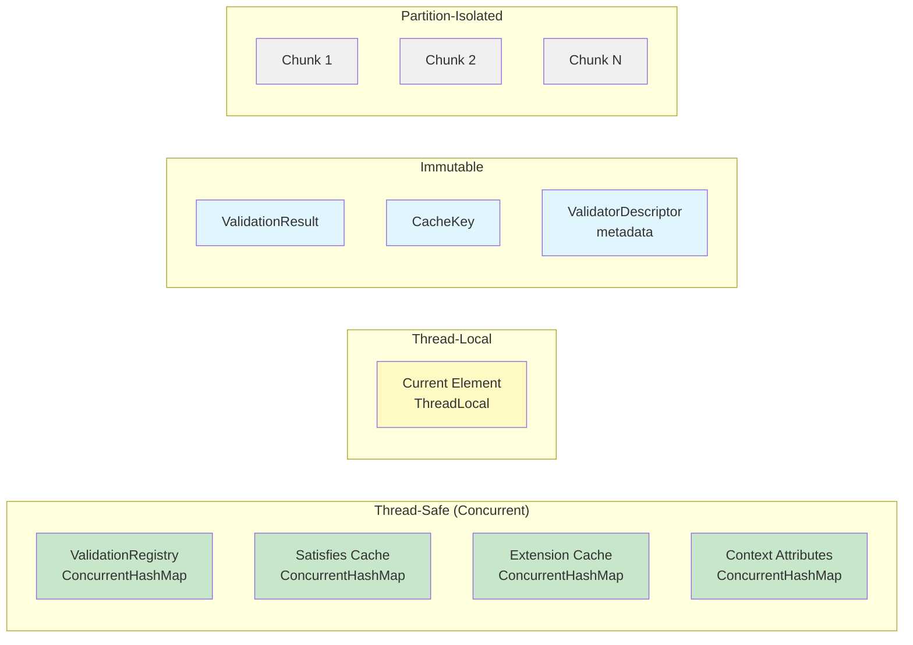

**Thread Safety Guarantees:**
- **Registry:** Thread-safe registration and lookup
- **Context:** ThreadLocal current element prevents races
- **Caches:** ConcurrentHashMap for parallel access
- **Results:** Immutable value objects
- **Chunks:** No shared state between parallel workers

---

## Execution Flow

### Sequential Validation Flow

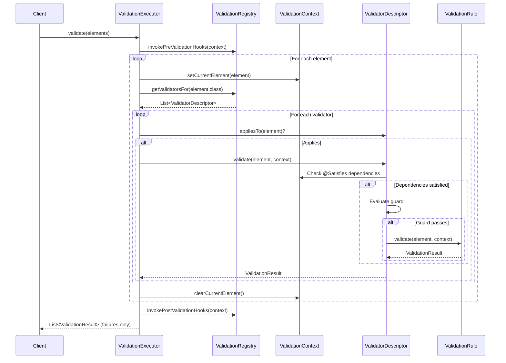

### Parallel Validation Flow

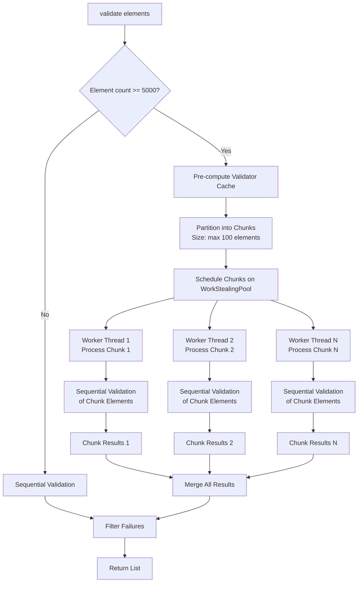

### Extension Method Invocation

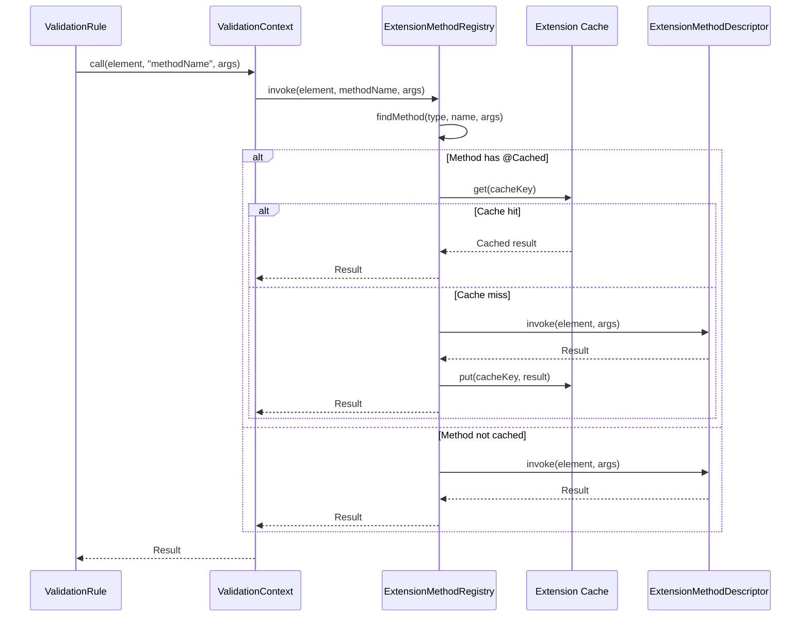

---

## Thread Safety and Concurrency

### Parallel Execution Architecture

The framework uses a **work-stealing thread pool** (ForkJoinPool) for parallel validation:

```
┌─────────────────────────────────────────────────────────┐
│              ValidationExecutor                          │
│                                                          │
│  Elements (10,000)                                       │
│      ↓                                                   │
│  Partition into Chunks (100 each)                        │
│      ↓                                                   │
│  ┌──────────┬──────────┬──────────┬─────────────┐       │
│  │ Chunk 1  │ Chunk 2  │ Chunk 3  │  ... 100   │       │
│  │ (100)    │ (100)    │ (100)    │  (100)      │       │
│  └──────────┴──────────┴──────────┴─────────────┘       │
│      ↓           ↓           ↓            ↓              │
│  ┌────────────────────────────────────────────────┐     │
│  │      ForkJoinPool (Work-Stealing)              │     │
│  │                                                 │     │
│  │  [Thread 1] → Process Chunk 1                  │     │
│  │  [Thread 2] → Process Chunk 2                  │     │
│  │  [Thread 3] → Process Chunk 3                  │     │
│  │  [Thread 4] → Steal work if idle               │     │
│  │  ...                                            │     │
│  │  [Thread N] → Process Chunk N                  │     │
│  └────────────────────────────────────────────────┘     │
│      ↓                                                   │
│  CompletableFuture.join() - Wait for all                │
│      ↓                                                   │
│  Merge Results                                           │
└─────────────────────────────────────────────────────────┘
```

### Thread-Local State Management

```java
// Each thread maintains its own current element
private final ThreadLocal<EObject> currentElement = new ThreadLocal<>();

// Set before validating chunk
context.setCurrentElement(element);

// Access in validation rules
EObject current = context.getCurrentElement();

// Clear after chunk completes (prevent memory leak)
context.clearCurrentElement();
```

### Concurrent Data Structures

| Structure | Type | Thread Safety | Purpose |
|-----------|------|---------------|---------|
| `validators` | HashMap | Read-only after registration | Validator lookup |
| `satisfiesCache` | ConcurrentHashMap | Concurrent reads/writes | Dependency cache |
| `extensionCache` | ConcurrentHashMap | Concurrent reads/writes | Extension result cache |
| `attributes` | ConcurrentHashMap | Concurrent reads/writes | Custom attributes |
| `currentElement` | ThreadLocal | Thread-isolated | Current element |

---

## Extension Points

The framework provides several extension points for customization:

### 1. ModelProvider Interface

Integrate any EMF metamodel by implementing `ModelProvider`:

```java
public interface ModelProvider {
    <T extends EObject> Collection<T> getAllContents(ResourceSet rs, Class<T> type);
    default String getName(EObject element) { /* ... */ }
    default String getTypeName(EObject element) { /* ... */ }
}
```

**Use Cases:**
- Metamodel-specific model traversal
- Custom naming conventions
- Type name resolution for error messages

### 2. Extension Methods

Add reusable helper functions via `@ExtensionMethod`:

```java
@ValidationContext(EntityType.class)
public class EntityExtensions {
    @ExtensionMethod(elementType = EntityType.class)
    public List<Attribute> getAllAttributes(EntityType entity) {
        // Recursive attribute collection
    }
}
```

**Use Cases:**
- Reusable computation logic
- Model navigation helpers
- Complex queries

### 3. Pre/Post Validation Hooks

Lifecycle callbacks for setup and teardown:

```java
@PreValidation
public void setUp(ValidationContext ctx) {
    // Initialize caches, collect statistics
}

@PostValidation
public void tearDown(ValidationContext ctx) {
    // Cleanup, logging, metrics
}
```

**Use Cases:**
- Cache initialization
- Performance metrics collection
- Logging and debugging
- Resource cleanup

### 4. Custom Attributes

Share data between hooks via context attributes:

```java
@PreValidation
public void setUp(ValidationContext ctx) {
    ctx.setAttribute("startTime", System.currentTimeMillis());
}

@PostValidation
public void tearDown(ValidationContext ctx) {
    long startTime = ctx.getAttribute("startTime");
    long duration = System.currentTimeMillis() - startTime;
    log.info("Validation took {} ms", duration);
}
```

### 5. Guard Functions

Custom conditional logic for rule execution:

```java
@Guard(method = "isNotAbstract")
@Constraint(name = "MustHaveTable", message = "Concrete entity must have table")
public ValidationRule mustHaveTable() { /* ... */ }

private boolean isNotAbstract(EObject element, ValidationContext ctx) {
    return !((EntityType) element).isAbstract();
}
```

**Use Cases:**
- Conditional validation based on element state
- Context-aware rule activation
- Cross-cutting concerns

---

## Summary

The Judo Zeta validation framework provides a modern, performant, and type-safe approach to EMF model validation through:

- **Annotation-driven DSL** for declarative rule definition
- **Parallel execution engine** with automatic work partitioning
- **Functional programming** for composable validation logic
- **Comprehensive caching** for performance optimization
- **Thread-safe architecture** for concurrent validation
- **Extensible design** for metamodel integration

The architecture balances simplicity, performance, and flexibility, making it suitable for both small and large-scale EMF metamodel validation scenarios.

---

**Navigation:** [Documentation Home](../README.md) > [Architecture](./README.md) > Overview
