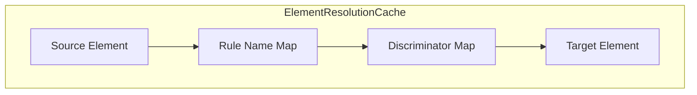

# Element Resolution Cache

**Navigation**: [Documentation Hub](../../index.md) > [Transformation](../index.md) > [Architecture](overview.md) > Element Resolution Cache

Internal structure of the element resolution cache.

## Cache Structure



## Three-Level Structure

```java
// Conceptual structure
Map<EObject,                    // Level 1: Source element
    Map<String,                 // Level 2: Rule name
        Map<String,             // Level 3: Discriminator (empty string if none)
            EObject>>>          // Value: Target element
```

## Cache Operations

### Store (during rule execution)

```java
// Standard mapping
cache.store(sourceElement, "EntityType2Table", "", targetTable);

// Discriminated mapping
cache.store(sourceElement, "RelationCRUD", "create", createOp);
cache.store(sourceElement, "RelationCRUD", "update", updateOp);
```

### Lookup (during equivalent() call)

```java
// Standard lookup
EObject target = cache.get(sourceElement, "EntityType2Table", "");

// Discriminated lookup
EObject createOp = cache.get(sourceElement, "RelationCRUD", "create");
```

## Example Cache State

After transforming Customer entity with relations:

```
cache = {
    customerEntity: {
        "EntityType2Table": {
            "": customerTable
        }
    },
    ordersRelation: {
        "RelationCRUD": {
            "create": createOrderOp,
            "read": readOrderOp,
            "update": updateOrderOp,
            "delete": deleteOrderOp
        }
    },
    nameAttribute: {
        "Attribute2Column": {
            "": nameColumn
        }
    }
}
```

## Thread Safety Implementation

```java
public class ElementResolutionCache {
    private final ConcurrentMap<EObject, 
        ConcurrentMap<String, 
            ConcurrentMap<String, EObject>>> cache = new ConcurrentHashMap<>();
    
    public void store(EObject source, String ruleName, String discriminator, EObject target) {
        cache.computeIfAbsent(source, k -> new ConcurrentHashMap<>())
             .computeIfAbsent(ruleName, k -> new ConcurrentHashMap<>())
             .put(discriminator, target);
    }
    
    public EObject get(EObject source, String ruleName, String discriminator) {
        return Optional.ofNullable(cache.get(source))
            .map(m -> m.get(ruleName))
            .map(m -> m.get(discriminator))
            .orElse(null);
    }
}
```

## Performance

| Operation | Complexity |
|-----------|------------|
| Store | O(1) amortized |
| Lookup | O(1) |
| Memory | O(n) where n = number of transformations |

---

**Previous**: [Parallel Execution](parallel-execution.md) | **Next**: [Rule Inheritance Graph](rule-inheritance-graph.md)
