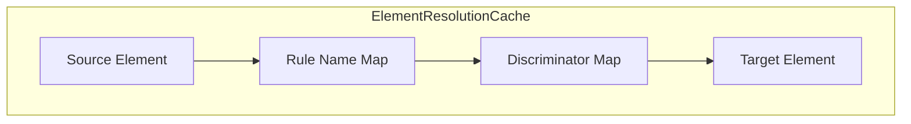

# Element Resolution Cache

**Navigation**: [Documentation Hub](../../index.md) > [Transformation](../index.md) > [Architecture](overview.md) > Element Resolution Cache

Internal structure of the element resolution cache.

## Cache Structure



## Three-Level Structure

```java
// Conceptual structure
Map<EObject,                    // Level 1: Source element
    Map<String,                 // Level 2: Rule name
        Map<String,             // Level 3: Discriminator (empty string if none)
            EObject>>>          // Value: Target element
```

## Cache Operations

### Store (during rule execution)

```java
// Standard mapping
cache.store(sourceElement, "EntityType2Table", "", targetTable);

// Discriminated mapping
cache.store(sourceElement, "RelationCRUD", "create", createOp);
cache.store(sourceElement, "RelationCRUD", "update", updateOp);
```

### Lookup (during equivalent() call)

```java
// Standard lookup
EObject target = cache.get(sourceElement, "EntityType2Table", "");

// Discriminated lookup
EObject createOp = cache.get(sourceElement, "RelationCRUD", "create");
```

### XMI ID-based Lookup (ETL Semantics)

When `useStructuredIds` is enabled (default), `equivalent()` also searches by XMI ID:

```java
// 1. Check object-reference cache first
EObject cached = cache.get(sourceElement, ruleName, "");
if (cached != null) return cached;

// 2. Generate expected structured XMI ID
String xmiId = generateStructuredId(sourceElement, ruleName);
// Example: Customer/(esm/_abc123)/Entity2Table

// 3. Look up by XMI ID in target resource and pending IDs
EObject existing = findByXmiId(xmiId, targetType);
if (existing != null) {
    cache.store(sourceElement, ruleName, "", existing);  // Cache for future
    return existing;
}

// 4. Execute rule if not found
```

This enables cross-phase element discovery when elements are created in separate transformation phases.

## Example Cache State

After transforming Customer entity with relations:

```
cache = {
    customerEntity: {
        "EntityType2Table": {
            "": customerTable
        }
    },
    ordersRelation: {
        "RelationCRUD": {
            "create": createOrderOp,
            "read": readOrderOp,
            "update": updateOrderOp,
            "delete": deleteOrderOp
        }
    },
    nameAttribute: {
        "Attribute2Column": {
            "": nameColumn
        }
    }
}
```

## Thread Safety Implementation

```java
public class ElementResolutionCache {
    private final ConcurrentMap<EObject, 
        ConcurrentMap<String, 
            ConcurrentMap<String, EObject>>> cache = new ConcurrentHashMap<>();
    
    public void store(EObject source, String ruleName, String discriminator, EObject target) {
        cache.computeIfAbsent(source, k -> new ConcurrentHashMap<>())
             .computeIfAbsent(ruleName, k -> new ConcurrentHashMap<>())
             .put(discriminator, target);
    }
    
    public EObject get(EObject source, String ruleName, String discriminator) {
        return Optional.ofNullable(cache.get(source))
            .map(m -> m.get(ruleName))
            .map(m -> m.get(discriminator))
            .orElse(null);
    }
}
```

## Structured XMI ID Format

ZETA generates ETL-style structured XMI IDs for traceability:

```
Standard:      <source-name>/(<alias>/<source-id>)/<rule-name>
Discriminated: <source-name>/(<alias>/<source-id>)/<rule-name>/(discriminator/<value>)

Examples:
  Customer/(esm/_abc123)/Entity2Table
  Customer/(esm/_abc123)/TableAction/(discriminator/relation1)
```

The `<alias>` is the registered resource alias (e.g., "esm", "asm", "mapping", "source").

When `useStructuredIds` is disabled, sequence-based IDs are used instead (`_seq0`, `_seq1`, etc.).

## Performance

| Operation | Complexity |
|-----------|------------|
| Store | O(1) amortized |
| Object-reference lookup | O(1) |
| XMI ID-based lookup | O(n) in pending IDs, O(1) in committed resource |
| Memory | O(n) where n = number of transformations |

---

**Previous**: [Parallel Execution](parallel-execution.md) | **Next**: [Rule Inheritance Graph](rule-inheritance-graph.md)
