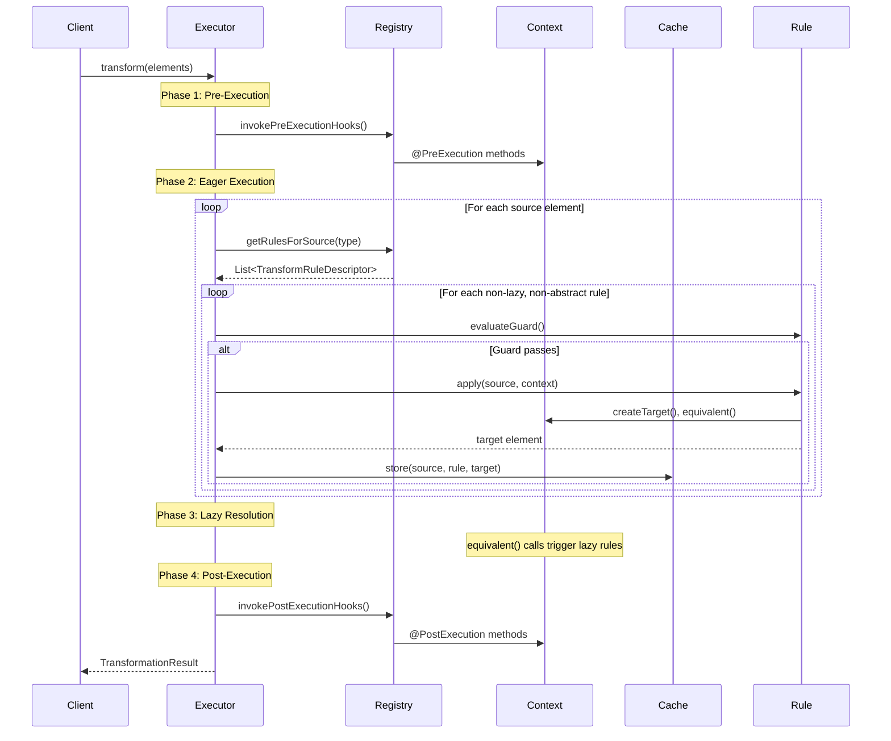
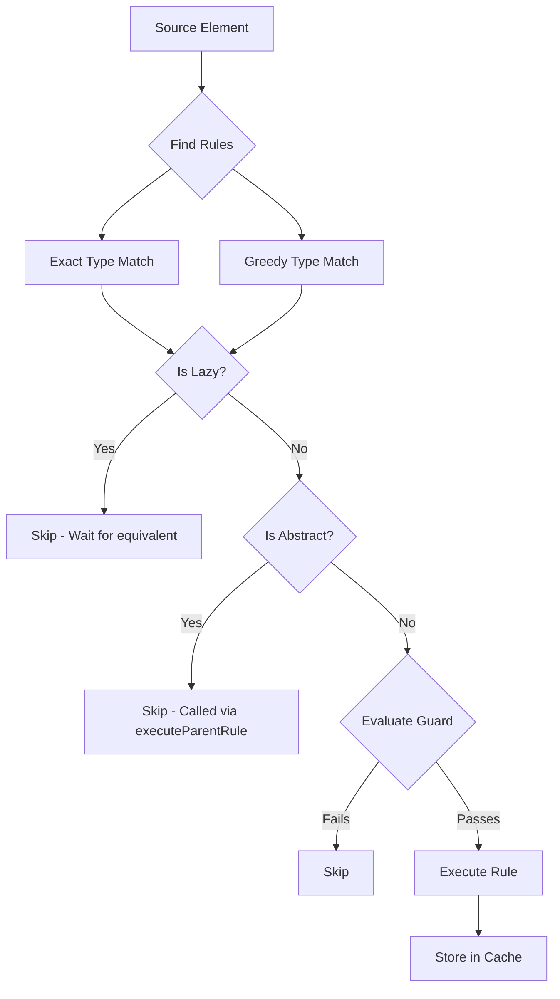

# Execution Flow

**Navigation**: [Documentation Hub](../../index.md) > [Transformation](../index.md) > [Architecture](overview.md) > Execution Flow

Detailed execution flow of the transformation process.

## Transformation Lifecycle

## Phase Details

### Phase 1: Pre-Execution

1. Clear caches from previous runs
2. Invoke all `@PreExecution` methods in registration order
3. Initialize custom attributes

### Phase 2: Eager Execution

For each source element:
1. Find applicable rules (matching source type)
2. Filter out `@Lazy` and `@Abstract` rules
3. For each eligible rule:
   - Evaluate `@Guard` condition
   - If guard passes, execute rule
   - Store result in `ElementResolutionCache`
   - Record entry in `TransformationTrace`

### Phase 3: Lazy Resolution

- Lazy rules execute on-demand via `equivalent()` calls
- Results are cached after first execution
- Subsequent calls return cached results

**Inheritance State Isolation**: When `equivalent()` is called from within a transform function, the framework automatically:
1. Saves the caller's inheritance state (pre-created target, inheritance execution flag)
2. Resets to a clean state for the nested transformation
3. Executes the nested rule with its own independent context
4. Restores the caller's inheritance state after completion

This ensures that `equivalent()` calls from within `@Extends` rules produce independent targets, not accidentally reusing the caller's pre-created target.

### Phase 4: Post-Execution

1. Invoke all `@PostExecution` methods
2. Build `TransformationResult` with trace
3. Return result to caller

## Rule Selection Algorithm

---

**Previous**: [Overview](overview.md) | **Next**: [Parallel Execution](parallel-execution.md)
