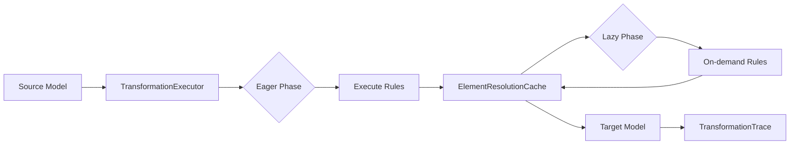

# Architecture Overview

**Navigation**: [Documentation Hub](../../index.md) > [Transformation](../index.md) > [Architecture](overview.md) > Overview

System architecture of the Judo Zeta Transformation Framework.

## Component Diagram

```mermaid
graph TB
    subgraph "Transformation Framework"
        TR[TransformationRegistry]
        TE[TransformationExecutor]
        TC[TransformationContext]
        ERC[ElementResolutionCache]
        RIG[RuleInheritanceGraph]
        TRD[TransformRuleDescriptor]
    end
    
    subgraph "Input"
        SRS[Source ResourceSet]
        TRS[Target ResourceSet]
        TCC[@TransformationContext Classes]
    end
    
    subgraph "Output"
        TResult[TransformationResult]
        TTrace[TransformationTrace]
    end
    
    TCC -->|register| TR
    TR -->|contains| TRD
    TR -->|builds| RIG
    SRS -->|input| TC
    TRS -->|output| TC
    TR -->|uses| TE
    TC -->|uses| TE
    TE -->|uses| ERC
    TE -->|produces| TResult
    TResult -->|contains| TTrace
```

## Core Components

### TransformationRegistry

- Scans and registers transformation classes
- Discovers `@TransformRule` annotated methods
- Builds `TransformRuleDescriptor` for each rule
- Indexes rules by source type and name
- Manages pre/post execution hooks

### TransformationExecutor

- Orchestrates transformation execution
- Manages two-phase execution (eager + lazy)
- Handles parallel execution for large models
- Invokes lifecycle hooks
- Produces `TransformationResult`

### TransformationContext

- Provides API for rule implementations
- `createTarget()` - create target elements
- `equivalent()` / `equivalents()` - element resolution
- `executeParentRule()` - rule inheritance
- Manages custom attributes

### ElementResolutionCache

- Thread-safe cache for source→target mappings
- Supports discriminated entries
- O(1) lookup performance
- Used by `equivalent()` calls

### RuleInheritanceGraph

- Builds dependency graph from `@Extends`
- Topologically sorts rules
- Detects circular dependencies
- Determines execution order

### TransformRuleDescriptor

- Metadata for a single rule
- Source/target types
- Rule modifiers (lazy, abstract, primary, greedy)
- Guard method reference
- Parent rule references

## Data Flow



---

**Next**: [Execution Flow](execution-flow.md)
