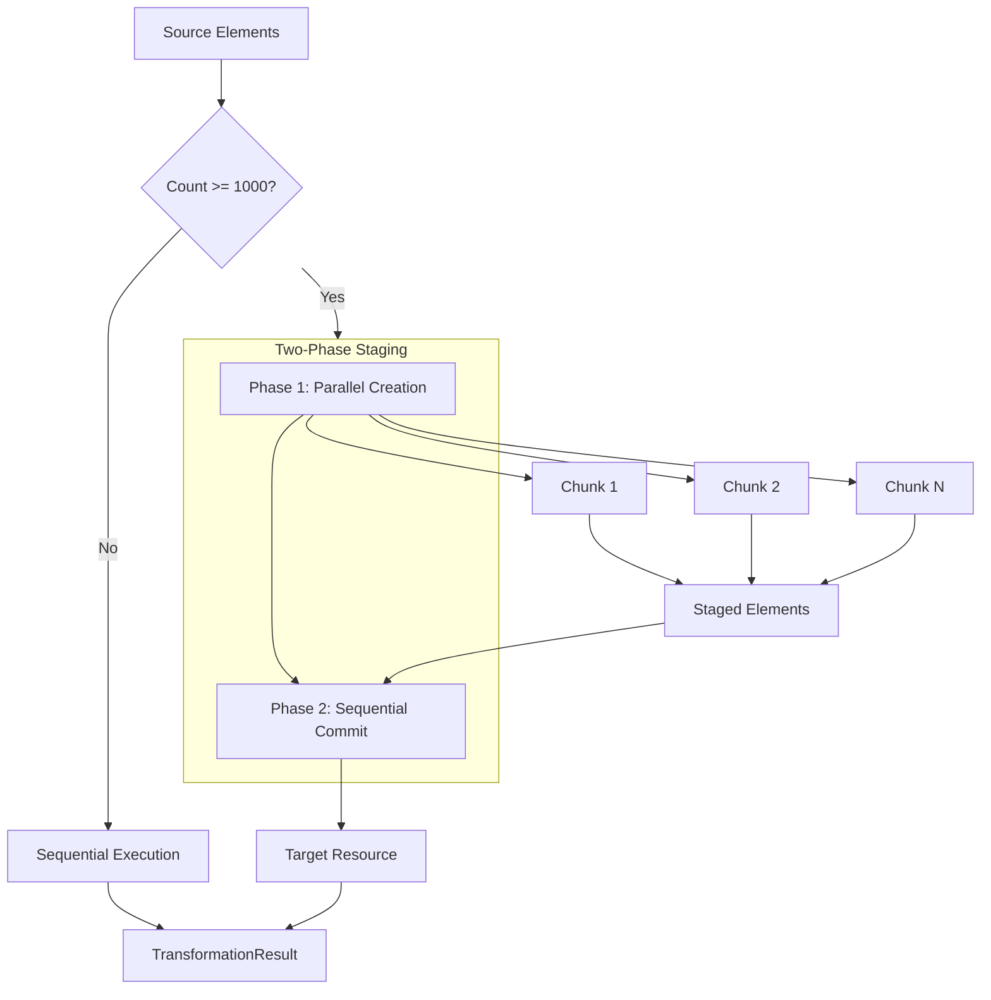

# Parallel Execution

**Navigation**: [Documentation Hub](../../index.md) > [Transformation](../index.md) > [Architecture](overview.md) > Parallel Execution

How the framework handles parallel transformation for large models with thread-safety guarantees.

## Parallelization Strategy



## Threshold Configuration

| Parameter | Default | Description |
|-----------|---------|-------------|
| Parallel Threshold | **1000** | Minimum elements to enable parallel |
| Chunk Size | 100 | Elements per work unit |

```java
TransformationExecutor executor = TransformationExecutor.builder()
    .registry(registry)
    .context(context)
    .parallel(true)            // Enable parallel (default: true)
    .parallelThreshold(500)    // Lower threshold (default: 1000)
    .chunkSize(50)             // Smaller chunks (default: 100)
    .build();
```

## Two-Phase Staging Approach

### Phase 1: Parallel Element Creation
- Multiple threads create target elements concurrently
- Elements stored in staging area (not added to Resource yet)
- Each element gets a sequence number for deterministic ordering

### Phase 2: Sequential Commit
- Single thread adds staged elements to target Resource
- Elements added in sequence order (deterministic)
- Maintains element ordering across parallel runs

```java
// Conceptual implementation
// Phase 1: Parallel
stagedElements.add(new StagedElement(target, sequence.getAndIncrement()));

// Phase 2: Sequential (after all parallel work completes)
stagedElements.stream()
    .sorted(Comparator.comparingLong(StagedElement::getSequence))
    .forEach(e -> targetResource.getContents().add(e.getElement()));
```

## Thread-Safety Guarantees

| Operation | Thread-Safe? | Mechanism |
|-----------|--------------|-----------|
| `ctx.createTarget()` | ✅ Yes | Staging + atomic sequence |
| `ctx.equivalent()` | ✅ Yes | Atomic getOrCreate() |
| `ctx.executeParentRule()` | ✅ Yes | Per-key locking |
| `ctx.getAttribute()` | ✅ Yes | ConcurrentHashMap |
| Direct Resource modification | ❌ No | Avoid in parallel rules |
| Shared mutable fields | ❌ No | Use thread-safe alternatives |

## Atomic Cache Operations

### Problem: Race Conditions
Without atomic operations, parallel threads could:
1. Both check cache (miss)
2. Both execute same rule
3. Create duplicate target elements

### Solution: getOrCreate() Pattern
```java
// Atomic: lock covers cache check + guard + rule execution
T target = cache.getOrCreate(source, ruleName, () -> {
    if (!evaluateGuard(source)) return null;
    return executeRule(source);
}, isPrimary);
```

### Per-Key Locking
- Each `(source, ruleName)` pair has its own `ReentrantLock`
- Different source/rule combinations execute in parallel
- Same source+rule: first thread executes, others wait for cached result

### Guard Rejection Caching
```java
// If supplier returns null (guard failed), rejection is cached
rejectedKeys.add(new CacheKey(source, ruleName));
// Subsequent calls return null without re-evaluating guard
```

## Error Handling: Fail-Fast

### First Error Stops All Processing
```java
// Error captured atomically
firstError.compareAndSet(null, transformException);

// Checked after parallel phase completes
if (firstError.get() != null) {
    throw (TransformationException) firstError.get();
}
```

### TransformationException Context
```java
try {
    executor.transform();
} catch (TransformationException e) {
    EObject element = e.getFailedElement();  // Source that caused failure
    String rule = e.getRuleName();           // Which rule failed
    Throwable cause = e.getCause();          // Original exception

    log.error("Rule '{}' failed on {}: {}", rule, element, cause.getMessage());
}
```

## Deterministic Results

Parallel execution produces **identical results** to sequential:

| Aspect | Guaranteed |
|--------|------------|
| Same target elements created | ✅ |
| Same element properties | ✅ |
| Same relationships | ✅ |
| Same element order in Resource | ✅ (via sequence numbers) |
| Same XMI IDs | ✅ (via structured ID generation) |

## Executor Reuse

The executor can be reused for multiple transformations:

```java
// Create once (thread pool created lazily)
TransformationExecutor executor = TransformationExecutor.builder()
    .registry(registry)
    .context(context)
    .build();

// Reusable - state reset on each transform()
executor.transform();  // First transformation
executor.transform();  // Second transformation (same executor)

// Shutdown when done (releases thread pool)
executor.shutdown();
```

### Automatic State Reset
Each `transform()` call resets:
- Element resolution cache
- Extension method caches
- Staging area
- Activation tracker (for `@ActivityBased`)

## Performance Characteristics

| Model Size | Sequential | Parallel | Speedup |
|------------|------------|----------|---------|
| 500 | 50ms | 50ms | 1x (below threshold) |
| 1,000 | 100ms | 80ms | 1.25x |
| 5,000 | 500ms | 180ms | 2.8x |
| 10,000 | 1000ms | 280ms | 3.6x |
| 50,000 | 5000ms | 1400ms | 3.6x |

*Typical values on 8-core CPU with work-stealing thread pool*

---

**Previous**: [Execution Flow](execution-flow.md) | **Next**: [Element Resolution Cache](element-resolution-cache.md)
