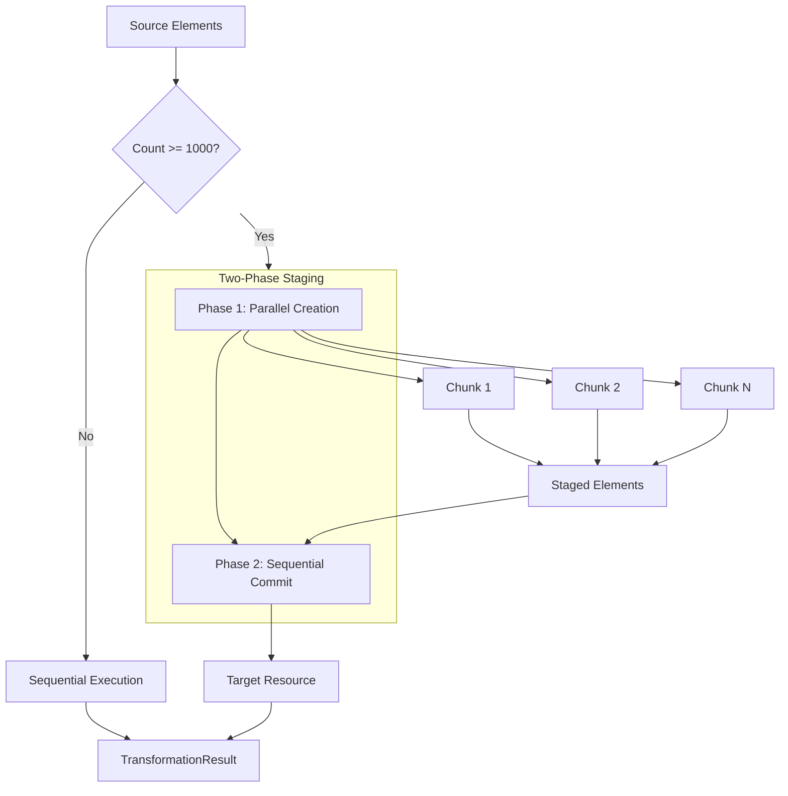
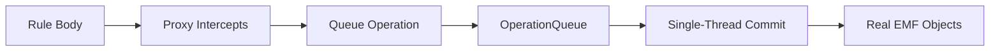

# Parallel Execution

**Navigation**: [Documentation Hub](../../index.md) > [Transformation](../index.md) > [Architecture](overview.md) > Parallel Execution

How the framework handles parallel transformation for large models with thread-safety guarantees.

## Parallelization Strategy



## Threshold Configuration

| Parameter | Default | Description |
|-----------|---------|-------------|
| Parallel Threshold | **1000** | Minimum elements to enable parallel |
| Chunk Size | 100 | Elements per work unit |

```java
TransformationExecutor executor = TransformationExecutor.builder()
    .registry(registry)
    .context(context)
    .parallel(true)            // Enable parallel (default: true)
    .parallelThreshold(500)    // Lower threshold (default: 1000)
    .chunkSize(50)             // Smaller chunks (default: 100)
    .build();
```

## Two-Phase Staging Approach

### Phase 1: Parallel Element Creation
- Multiple threads create target elements concurrently
- Elements stored in staging area (not added to Resource yet)
- Each element gets a sequence number for deterministic ordering

### Phase 2: Sequential Commit
- Single thread adds staged elements to target Resource
- Elements added in sequence order (deterministic)
- Maintains element ordering across parallel runs

```java
// Conceptual implementation
// Phase 1: Parallel
stagedElements.add(new StagedElement(target, sequence.getAndIncrement()));

// Phase 2: Sequential (after all parallel work completes)
stagedElements.stream()
    .sorted(Comparator.comparingLong(StagedElement::getSequence))
    .forEach(e -> targetResource.getContents().add(e.getElement()));
```

## Thread-Safety Guarantees

| Operation | Thread-Safe? | Mechanism |
|-----------|--------------|-----------|
| `ctx.createTarget()` | ✅ Yes | Staging + atomic sequence |
| `ctx.equivalent()` | ✅ Yes | Atomic getOrCreate() |
| `ctx.executeParentRule()` | ✅ Yes | Per-key locking |
| `ctx.getAttribute()` | ✅ Yes | ConcurrentHashMap |
| Direct Resource modification | ❌ No | Avoid in parallel rules |
| Shared mutable fields | ❌ No | Use thread-safe alternatives |

## Atomic Cache Operations

### Problem: Race Conditions
Without atomic operations, parallel threads could:
1. Both check cache (miss)
2. Both execute same rule
3. Create duplicate target elements

### Solution: getOrCreate() Pattern
```java
// Atomic: lock covers cache check + guard + rule execution
T target = cache.getOrCreate(source, ruleName, () -> {
    if (!evaluateGuard(source)) return null;
    return executeRule(source);
}, isPrimary);
```

### Per-Key Locking Strategy
- Each `(source, ruleName)` pair has its own `ReentrantLock`
- Different source/rule combinations execute in parallel
- Same source+rule: first thread executes, others wait for cached result
- Uses `ReentrantLock` to handle recursive calls from the same thread

```java
// Lock stored in ConcurrentHashMap per (source, ruleName) key
ReentrantLock lock = ruleLocks.computeIfAbsent(key, k -> new ReentrantLock());
```

### Why Per-Key Locks (Not Lock Striping)

The framework uses **per-key locks** rather than lock striping (fixed array of locks) to avoid deadlocks:

```
Lock Striping Problem:
┌─────────────────────────────────────────────────────────────┐
│ Thread A: holds stripe[42] for (src1, ruleA)                │
│           → calls equivalent() → needs stripe[99]           │
│                                                             │
│ Thread B: holds stripe[99] for (src2, ruleB)                │
│           → calls equivalent() → needs stripe[42]           │
│                                                             │
│ DEADLOCK! Both threads waiting for each other's stripe      │
└─────────────────────────────────────────────────────────────┘

Per-Key Locks:
┌─────────────────────────────────────────────────────────────┐
│ Thread A: holds lock for (src1, ruleA)                      │
│           → calls equivalent() → gets lock for (src1, ruleB)│
│           → No collision with other threads                 │
│                                                             │
│ Thread B: holds lock for (src2, ruleB)                      │
│           → calls equivalent() → gets lock for (src2, ruleA)│
│           → No collision with Thread A                      │
│                                                             │
│ NO DEADLOCK - each (source, rule) has unique lock           │
└─────────────────────────────────────────────────────────────┘
```

**Key insight**: Rule bodies can call `equivalent()` which acquires another lock (nested locking). With lock striping, different `(source, rule)` pairs can hash to the same stripe, causing cross-thread deadlocks. Per-key locks guarantee each pair has its own lock, eliminating collision-based deadlocks.

### Timeout-Based Deadlock Detection

All lock acquisitions use `tryLock()` with a 30-second timeout to detect circular dependencies:

```java
boolean lockAcquired = lock.tryLock(30, TimeUnit.SECONDS);
if (!lockAcquired) {
    throw new RuntimeException(
        "Potential deadlock detected: timeout waiting for lock on " +
        "equivalent(" + source.eClass().getName() + ", " + ruleName + "). " +
        "This may indicate circular rule dependencies.");
}
```

### Guard Rejection Caching
```java
// If supplier returns null (guard failed), rejection is cached
rejectedKeys.add(new CacheKey(source, ruleName));
// Subsequent calls return null without re-evaluating guard
```

## Deferred Writes for EMF Thread-Safety

EMF's `EList` and `eSet()` operations are **not thread-safe**. The framework uses a deferred writes mechanism to prevent data corruption during parallel execution.

### The Problem: EMF is Not Thread-Safe

```java
// UNSAFE - Concurrent modifications corrupt EList internal state
Thread A: parent.getChildren().add(childA);  // Modifies internal array
Thread B: parent.getChildren().add(childB);  // Race condition!
```

### The Solution: Deferred EMF Operations



1. **Proxy Objects**: `ctx.createTarget()` returns a JDK dynamic proxy wrapping the real EMF object
2. **Operation Capture**: All `eSet()` and `EList` modifications are captured as immutable operation records
3. **Queue Storage**: Operations stored in thread-safe `OperationQueue` with sequence numbers
4. **Single-Thread Commit**: After parallel phase, operations are replayed sequentially in order

### Proxy Unwrapping for EMF Bidirectional References

EMF's bidirectional reference mechanism (`eOpposite`) uses `eInverseAdd()`/`eInverseRemove()` internally. These methods require **real `InternalEObject` instances**, not proxies.

```java
// Problem: EMF calls eInverseAdd with proxy
newValue.eInverseAdd(this, OPPOSITE_FEATURE_ID, ...);  // Fails if newValue is proxy!

// Solution: Unwrap at queue time, not apply time
private void handleSet(EStructuralFeature feature, Object value) {
    if (feature instanceof EReference) {
        EObject realValue = unwrap(value);  // Get real EMF object
        queue.add(new SetReferenceOp(delegate, feature, realValue, seq));
    }
}
```

**Key insight**: Reference values are unwrapped **when the operation is queued**, not when applied. This ensures EMF's inverse handling receives real objects during the single-threaded commit phase.

### Clearing Pending State After Commit

After `commitDeferredOperations()`, all proxy pending state must be cleared to prevent stale data and double-counting:

```java
public int commitDeferredOperations() {
    int committed = operationQueue.commit();

    // Clear pending state on all proxies
    // This prevents double-counting: without clearing, DeferredEList.getCombinedView()
    // would return both delegate elements (committed) AND pendingAdditions (stale)
    for (ProxyMarker proxy : createdProxies) {
        proxy.clearPendingState();
    }

    return committed;
}
```

**Why this matters**: Without clearing, `DeferredEList` would return both:
- Elements already committed to the real EMF list
- Stale pending additions that were already applied

This would cause issues like double-counting in list operations.

### Deferred Writes Compatibility Notes

| Operation | During Parallel Phase | After Commit |
|-----------|----------------------|--------------|
| `list.add(element)` | Queued, not visible | Applied, visible |
| `list.size()` | Returns combined size (committed + pending) | Returns real size |
| `list.contains(x)` | Checks both committed and pending | Checks real list |
| `element.eContainer()` | Returns null | Returns real container |
| Cross-rule visibility | Not visible | Visible |

### Two-Phase Proxy Unwrapping After Transformation

After transformation completes, all deferred proxies must be unwrapped to ensure the target model is fully materialised:

```java
public int unwrapAllProxiesInModel() {
    int unwrappedCount = 0;

    // Phase 1: Unwrap all proxies in the resolution cache
    // This is critical because equivalent() returns cached values, and if those
    // are proxies, they could end up in containment references after transformation
    unwrappedCount += resolutionCache.unwrapAllProxies();

    // Phase 2: Unwrap proxies in the target resource
    if (!targetResourceSet.getResources().isEmpty()) {
        Resource targetResource = targetResourceSet.getResources().get(0);
        for (EObject root : targetResource.getContents()) {
            unwrappedCount += unwrapProxiesRecursively(root);
        }
    }

    return unwrappedCount;
}
```

**Why Phase 1 matters**: The resolution cache may contain proxy objects returned by `equivalent()`. If these cached proxies aren't unwrapped, they can end up in containment references after transformation completes.

**Why Phase 2 matters**: Nested elements within the target resource may still be wrapped in proxies that need to be unwrapped.

## Error Handling: Fail-Fast

### First Error Stops All Processing
```java
// Error captured atomically
firstError.compareAndSet(null, transformException);

// Checked after parallel phase completes
if (firstError.get() != null) {
    throw (TransformationException) firstError.get();
}
```

### TransformationException Context
```java
try {
    executor.transform();
} catch (TransformationException e) {
    EObject element = e.getFailedElement();  // Source that caused failure
    String rule = e.getRuleName();           // Which rule failed
    Throwable cause = e.getCause();          // Original exception

    log.error("Rule '{}' failed on {}: {}", rule, element, cause.getMessage());
}
```

## Deterministic Results

Parallel execution produces **identical results** to sequential:

| Aspect | Guaranteed |
|--------|------------|
| Same target elements created | ✅ |
| Same element properties | ✅ |
| Same relationships | ✅ |
| Same element order in Resource | ✅ (via sequence numbers) |
| Same XMI IDs | ✅ (via structured ID generation) |

## Executor Reuse

The executor can be reused for multiple transformations:

```java
// Create once (thread pool created lazily)
TransformationExecutor executor = TransformationExecutor.builder()
    .registry(registry)
    .context(context)
    .build();

// Reusable - state reset on each transform()
executor.transform();  // First transformation
executor.transform();  // Second transformation (same executor)

// Shutdown when done (releases thread pool)
executor.shutdown();
```

### Automatic State Reset
Each `transform()` call resets:
- Element resolution cache
- Extension method caches
- Staging area
- Activation tracker (for `@ActivityBased`)

## Performance Characteristics

| Model Size | Sequential | Parallel | Speedup |
|------------|------------|----------|---------|
| 500 | 50ms | 50ms | 1x (below threshold) |
| 1,000 | 100ms | 80ms | 1.25x |
| 5,000 | 500ms | 180ms | 2.8x |
| 10,000 | 1000ms | 280ms | 3.6x |
| 50,000 | 5000ms | 1400ms | 3.6x |

*Typical values on 8-core CPU with work-stealing thread pool*

---

**Previous**: [Execution Flow](execution-flow.md) | **Next**: [Element Resolution Cache](element-resolution-cache.md)
