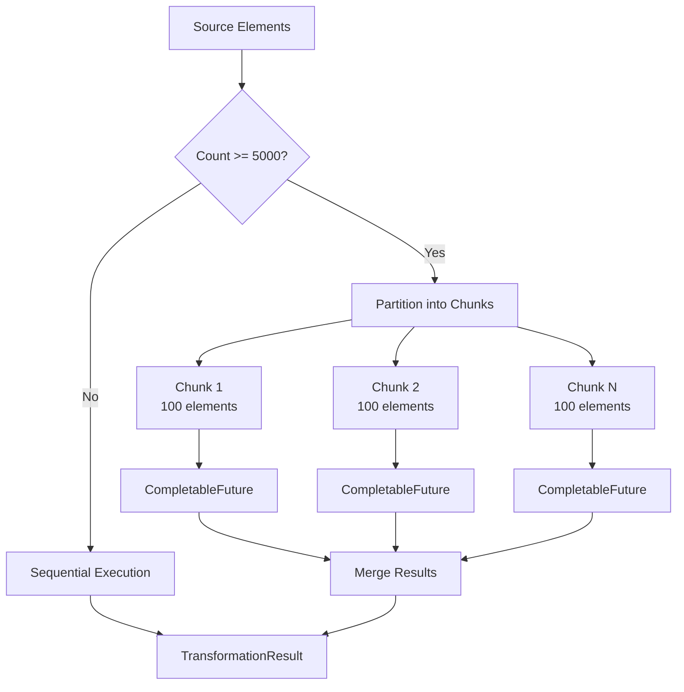

# Parallel Execution

**Navigation**: [Documentation Hub](../../index.md) > [Transformation](../index.md) > [Architecture](overview.md) > Parallel Execution

How the framework handles parallel transformation for large models.

## Parallelization Strategy



## Threshold Configuration

| Parameter | Value | Description |
|-----------|-------|-------------|
| Parallel Threshold | 5000 | Minimum elements to enable parallel |
| Chunk Size | 100 | Elements per work unit |

```java
TransformationExecutor executor = new TransformationExecutor(
    registry,
    context,
    true  // Enable parallel execution
);
```

## Thread Safety

### ElementResolutionCache

- Uses `ConcurrentHashMap` internally
- Thread-safe `put` and `get` operations
- No explicit synchronization needed

```java
// Conceptual implementation
ConcurrentMap<EObject, ConcurrentMap<String, ConcurrentMap<String, EObject>>> cache;
```

### TransformationContext

- Thread-safe for parallel access
- `createTarget()` synchronized on target ResourceSet
- `equivalent()` uses thread-safe cache

## Performance Characteristics

| Model Size | Sequential | Parallel | Speedup |
|------------|------------|----------|---------|
| 1,000 | 100ms | 100ms | 1x |
| 5,000 | 500ms | 200ms | 2.5x |
| 10,000 | 1000ms | 300ms | 3.3x |
| 50,000 | 5000ms | 1500ms | 3.3x |

*Typical values on 8-core CPU*

## Deterministic Results

Parallel execution produces same results as sequential:
- Same target elements created
- Same element properties
- Same relationships
- Only execution order varies

---

**Previous**: [Execution Flow](execution-flow.md) | **Next**: [Element Resolution Cache](element-resolution-cache.md)
