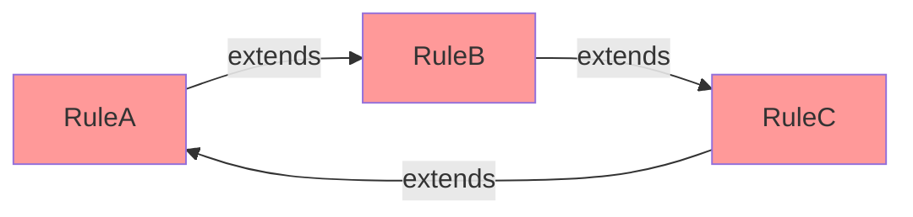

# Rule Inheritance Graph

**Navigation**: [Documentation Hub](../../index.md) > [Transformation](../index.md) > [Architecture](overview.md) > Rule Inheritance Graph

How rule inheritance is resolved and validated.

## Dependency Graph

```mermaid
graph TD
    A[NamedElement2NamedType<br/>@Abstract] --> B[TypedElement2TypedType<br/>@Abstract]
    A --> C[EntityType2Table]
    B --> D[Attribute2Column]
    B --> E[Parameter2Parameter]
    A --> F[Namespace2Schema]
    
    style A fill:#f9f,stroke:#333
    style B fill:#f9f,stroke:#333
```

*Pink nodes = @Abstract rules*

## Topological Sorting

Rules are sorted so parents execute before children:

**Before sorting**: `[Attribute2Column, NamedElement2NamedType, TypedElement2TypedType]`

**After sorting**: `[NamedElement2NamedType, TypedElement2TypedType, Attribute2Column]`

## Algorithm

```java
public List<TransformRuleDescriptor> topologicalSort() {
    // Kahn's algorithm
    Map<String, Integer> inDegree = new HashMap<>();
    Queue<TransformRuleDescriptor> queue = new LinkedList<>();
    List<TransformRuleDescriptor> result = new ArrayList<>();
    
    // Initialize in-degrees
    for (TransformRuleDescriptor rule : rules) {
        inDegree.put(rule.getName(), rule.getParentRules().size());
        if (rule.getParentRules().isEmpty()) {
            queue.add(rule);
        }
    }
    
    // Process nodes with no dependencies
    while (!queue.isEmpty()) {
        TransformRuleDescriptor rule = queue.poll();
        result.add(rule);
        
        for (TransformRuleDescriptor child : getChildRules(rule)) {
            int degree = inDegree.get(child.getName()) - 1;
            inDegree.put(child.getName(), degree);
            if (degree == 0) {
                queue.add(child);
            }
        }
    }
    
    // Check for cycles
    if (result.size() != rules.size()) {
        throw new IllegalStateException("Circular dependency detected");
    }
    
    return result;
}
```

## Cycle Detection



**Error**: `IllegalStateException: Circular dependency detected in rule inheritance: RuleA → RuleB → RuleC → RuleA`

## Validation

During registration:
1. Build dependency graph from `@Extends` annotations
2. Detect missing parent rules
3. Detect circular dependencies
4. Topologically sort for execution order

```java
// Throws if parent doesn't exist
@TransformRule(name = "Child")
@Extends("NonExistentParent")  // IllegalStateException
public TransformFunction<A, B> child() { ... }
```

---

**Previous**: [Element Resolution Cache](element-resolution-cache.md) | **Next**: [Reference Documentation](../reference/annotations.md)
