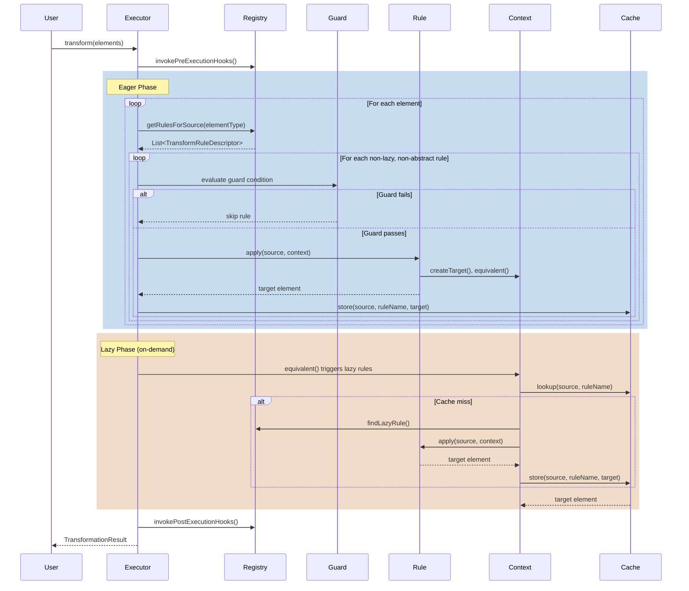

# Core Concepts

**Navigation**: [Documentation Hub](../../index.md) > [Transformation](../index.md) > [User Guide](core-concepts.md) > Core Concepts

This guide explains the fundamental concepts of the Judo Zeta Transformation Framework.

## Overview

The Judo Zeta Transformation Framework provides annotation-based model-to-model transformation for EMF models. Instead of using a domain-specific language (DSL) like ETL (Epsilon Transformation Language), you write transformation rules in pure Java using annotations.

### Key Benefits

- **Type Safety** - Compile-time type checking catches errors early
- **IDE Support** - Full autocomplete, refactoring, and debugging
- **Performance** - No interpretation overhead, automatic parallelization
- **Testability** - Standard unit testing for transformation rules
- **Maintainability** - Familiar Java code, no DSL to learn
- **Traceability** - Automatic source-to-target mapping with JSON export

## Core Components

```mermaid
graph TB
    A[@TransformationContext Class] -->|contains| B[@TransformRule Methods]
    B -->|returns| C[TransformFunction Lambda]
    C -->|uses| D[TransformationContext API]
    C -->|produces| E[Target Elements]
    F[TransformationRegistry] -->|scans| A
    G[TransformationExecutor] -->|uses| F
    G -->|executes| C
    G -->|tracks| H[ElementResolutionCache]
    G -->|produces| I[TransformationResult]
    I -->|contains| J[TransformationTrace]
```

### 1. @TransformationContext

Class-level annotation that declares the source and target types for transformations in this class.

```java
@TransformationContext(source = EntityType.class, target = Table.class)
public class Entity2TableTransformations {
    // All rules in this class transform EntityType-related elements to Table-related elements
}
```

**Parameters**:
- `source` - The primary source EMF element type (required)
- `target` - The primary target EMF element type (required)

**Key Points**:
- One transformation class typically handles one source-to-target relationship
- Can have multiple classes for different transformations
- Must be registered with `TransformationRegistry`

### 2. @TransformRule

Method-level annotation that defines a transformation rule.

```java
@TransformRule(
    name = "EntityType2Table",           // Unique identifier (required)
    description = "Transforms entities"   // Optional description
)
public TransformFunction<EntityType, Table> entityType2Table() {
    return (source, ctx) -> {
        // Transformation logic
    };
}
```

**Parameters**:
- `name` - Unique identifier for this rule (required)
- `description` - Human-readable description (optional)

### 3. TransformFunction Interface

Functional interface that performs the actual transformation:

```java
@FunctionalInterface
public interface TransformFunction<S extends EObject, T extends EObject> {
    T apply(S source, TransformationContext ctx);
}
```

Most commonly implemented as a lambda:

```java
@TransformRule(name = "Entity2Table")
public TransformFunction<EntityType, Table> entity2Table() {
    return (entity, ctx) -> {
        Table table = ctx.createTarget(Table.class);
        table.setName(entity.getName());
        return table;
    };
}
```

### 4. TransformationContext API

Provides access to transformation operations during rule execution:

```java
public interface TransformationContext {
    // Create a new target element
    <T extends EObject> T createTarget(Class<T> targetClass);
    
    // Get the transformed equivalent of a source element
    <T extends EObject> T equivalent(EObject source, Class<T> targetClass);
    
    // Get all transformed equivalents (when multiple rules transform same source)
    <T extends EObject> List<T> equivalents(EObject source, Class<T> targetClass);
    
    // Get discriminated equivalent (multiple outputs from same source)
    <T extends EObject> T equivalentDiscriminated(
        EObject source, Class<T> targetClass, String ruleName, String discriminator
    );
    
    // Execute a parent rule (for inheritance)
    <T extends EObject> T executeParentRule(String parentRuleName, EObject source);
    
    // Query source model
    <T extends EObject> Collection<T> getAllSource(Class<T> type);
    
    // Query target model
    <T extends EObject> Collection<T> getAllTarget(Class<T> type);
    
    // Custom attributes (for passing data between rules)
    void setAttribute(String key, Object value);
    Object getAttribute(String key);
}
```

**Common Usage**:

```java
@TransformRule(name = "Entity2Table")
public TransformFunction<EntityType, Table> entity2Table() {
    return (entity, ctx) -> {
        // Create target element
        Table table = ctx.createTarget(Table.class);
        table.setName(entity.getName());
        
        // Transform related elements using equivalent()
        for (Attribute attr : entity.getAttributes()) {
            Column column = ctx.equivalent(attr, Column.class);
            table.getColumns().add(column);
        }
        
        // Handle optional references
        if (entity.getSuperType() != null) {
            Table superTable = ctx.equivalent(entity.getSuperType(), Table.class);
            table.setParentTable(superTable);
        }
        
        return table;
    };
}
```

### 5. TransformationRegistry

Central registry for transformation classes. Scans classes for annotations and builds rule descriptors.

```java
TransformationRegistry registry = new TransformationRegistry();

// Register individual classes
registry.register(Entity2TableTransformations.class);
registry.register(Namespace2SchemaTransformations.class);
registry.register(Reference2ForeignKeyTransformations.class);

// Get rules for a source type
List<TransformRuleDescriptor> rules = registry.getRulesForSource(EntityType.class);

// Get rule by name
TransformRuleDescriptor rule = registry.getRuleByName("Entity2Table");
```

### 6. TransformationExecutor

Executes transformation rules and manages the transformation lifecycle.

```java
TransformationExecutor executor = new TransformationExecutor(
    registry,       // TransformationRegistry with registered rules
    context,        // TransformationContext for this execution
    true            // Enable parallel execution for large models
);

// Execute transformation
Collection<EObject> sourceElements = modelProvider.getAllContents(sourceResourceSet, EObject.class);
TransformationResult result = executor.transform(sourceElements);
```

**Execution Flow**:
1. Invoke pre-execution hooks (`@PreExecution`)
2. **Eager phase**: Execute all non-lazy, non-abstract rules
   - For each source element, find applicable rules
   - Evaluate guards
   - Execute transformation
   - Store source→target mapping in cache
3. **Lazy phase**: Rules execute on-demand via `equivalent()` calls
4. Invoke post-execution hooks (`@PostExecution`)
5. Return `TransformationResult` with trace

### 7. TransformationResult and Trace

Result object containing the transformation outcome and trace:

```java
TransformationResult result = executor.transform(sourceElements);

// Access target ResourceSet
ResourceSet targetModel = result.getTargetResourceSet();

// Access transformation trace
TransformationTrace trace = result.getTrace();

// Export trace to JSON for debugging
trace.saveToJson(new File("trace.json"));
String jsonString = trace.toJson();

// Get trace statistics
int entryCount = trace.getEntryCount();
```

**Trace JSON Format**:
```json
{
  "traceEntries": [
    {
      "ruleName": "EntityType2Table",
      "source": {
        "type": "EntityType",
        "id": "entity-customer",
        "name": "Customer"
      },
      "target": {
        "type": "Table",
        "id": "table-customer",
        "name": "Customer"
      },
      "primary": true
    }
  ],
  "entryCount": 42,
  "timestamp": 1699123456789
}
```

### 8. ElementResolutionCache

Thread-safe cache that tracks source-to-target mappings:

```java
// Cache structure (conceptual)
Map<EObject, Map<String, Map<String, EObject>>> cache;
//   source    ruleName  discriminator  target

// Standard mapping (no discriminator)
cache.get(source).get("Entity2Table").get("") → target

// Discriminated mapping
cache.get(source).get("Relation2Op").get("create") → createOperation
cache.get(source).get("Relation2Op").get("update") → updateOperation
```

The cache is automatically populated during transformation and queried by `equivalent()` calls.

## Transformation Rule Lifecycle



## Annotation Summary

| Annotation | Level | Purpose |
|------------|-------|---------|
| `@TransformationContext` | Class | Declares source/target types for transformation class |
| `@TransformRule` | Method | Defines a transformation rule |
| `@Lazy` | Method | Rule executes on-demand via `equivalent()` |
| `@Abstract` | Method | Rule only executes via `executeParentRule()` |
| `@Primary` | Method | Rule's result takes precedence in `equivalent()` |
| `@Greedy` | Method | Matches source type AND all subtypes |
| `@Extends` | Method | Inherits from parent rule(s) |
| `@Guard` | Method | Conditional execution based on guard method |
| `@PreExecution` | Method | Hook executed before transformation starts |
| `@PostExecution` | Method | Hook executed after transformation completes |

## Rule Modifiers Explained

### @Lazy - On-Demand Execution

```java
@TransformRule(name = "Reference2ForeignKey")
@Lazy  // Only executes when ctx.equivalent(ref, ForeignKey.class) is called
public TransformFunction<Reference, ForeignKey> reference2ForeignKey() {
    return (ref, ctx) -> {
        ForeignKey fk = ctx.createTarget(ForeignKey.class);
        fk.setName("fk_" + ref.getName());
        return fk;
    };
}
```

### @Abstract - Inheritance Only

```java
@TransformRule(name = "BaseNamedElement")
@Abstract  // Never executes directly, only via executeParentRule()
public TransformFunction<NamedElement, NamedType> baseNamedElement() {
    return (source, ctx) -> {
        NamedType target = ctx.createTarget(NamedType.class);
        target.setName(source.getName());
        return target;
    };
}
```

### @Primary - Preferred Result

```java
@TransformRule(name = "Entity2MainTable")
@Primary  // This result returned first by equivalent()
public TransformFunction<EntityType, Table> entity2MainTable() { ... }

@TransformRule(name = "Entity2AuditTable")
// Non-primary: only returned by equivalents()
public TransformFunction<EntityType, Table> entity2AuditTable() { ... }
```

### @Greedy - Subtype Matching

```java
@TransformRule(name = "NamedElement2NamedType")
@Greedy  // Matches NamedElement, EntityType, ActorType, etc.
public TransformFunction<NamedElement, NamedType> namedElement2NamedType() { ... }
```

### @Extends - Rule Inheritance

```java
@TransformRule(name = "Entity2Table")
@Extends("BaseNamedElement")  // Calls parent rule first
public TransformFunction<EntityType, Table> entity2Table() {
    return (entity, ctx) -> {
        Table table = ctx.executeParentRule("BaseNamedElement", entity);
        // Add entity-specific logic
        return table;
    };
}
```

## Working with EMF Types

The framework works seamlessly with EMF:

```java
@TransformationContext(source = EntityType.class, target = Table.class)
public class Entity2TableTransformations {
    
    @TransformRule(name = "Entity2Table")
    public TransformFunction<EntityType, Table> entity2Table() {
        return (entity, ctx) -> {
            Table table = ctx.createTarget(Table.class);
            
            // Access EMF features
            String name = entity.getName();
            EntityType superType = entity.getSuperType();
            EList<Attribute> attributes = entity.getAttributes();
            EObject container = entity.eContainer();
            
            // Check EMF metadata
            if (entity.eIsProxy()) {
                // Handle unresolved proxy
            }
            
            // Use EClass for type checks
            EClass eClass = entity.eClass();
            
            return table;
        };
    }
}
```

## Comparison with Validation Framework

| Aspect | Validation | Transformation |
|--------|------------|----------------|
| Purpose | Check model correctness | Convert model to another model |
| Input | Single model | Source model |
| Output | ValidationResults | Target model + trace |
| Rule result | Pass/Fail/Warning | Target element(s) |
| Context annotation | `@ValidationContext` | `@TransformationContext` |
| Rule annotation | `@Constraint`/`@Critique` | `@TransformRule` |
| Dependencies | `@Satisfies` | `@Extends` |
| On-demand | N/A | `@Lazy` |

## Next Steps

- **[Transformation Rules](transformation-rules.md)** - Learn advanced rule patterns
- **[Element Resolution](element-resolution.md)** - Master equivalent() semantics
- **[Lazy Evaluation](lazy-evaluation.md)** - On-demand transformation
- **[Rule Inheritance](rule-inheritance.md)** - Code reuse with @Extends
- **[Examples](../examples/simple-transformations.md)** - See real-world examples

## Related Topics

- [Getting Started](../getting-started.md) - Installation and first transformation
- [Annotations Reference](../reference/annotations.md) - Complete annotation documentation
- [TransformationContext API](../reference/transformation-context.md) - Full API reference

---

**Previous**: [Getting Started](../getting-started.md) | **Next**: [Transformation Rules](transformation-rules.md)
