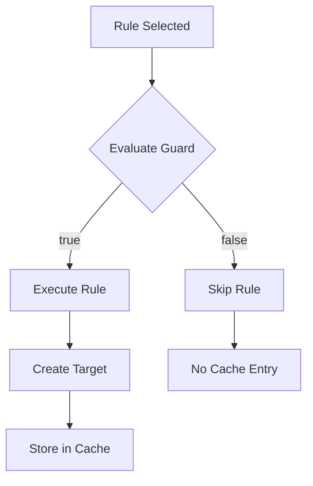

# Guards and Conditions

**Navigation**: [Documentation Hub](../../index.md) > [Transformation](../index.md) > [User Guide](core-concepts.md) > Guards and Conditions

Guards enable conditional transformation - rules only execute when guard conditions are met.

## @Guard Annotation

```java
@TransformRule(name = "AbstractEntity2AbstractTable")
@Guard(method = "isAbstract")
public TransformFunction<EntityType, Table> abstractEntity2AbstractTable() {
    return (entity, ctx) -> {
        Table table = ctx.createTarget(Table.class);
        table.setName(entity.getName());
        table.setAbstract(true);
        return table;
    };
}

// Guard method - returns true if rule should execute
private boolean isAbstract(EObject element, TransformationContext ctx) {
    return ((EntityType) element).isAbstract();
}
```

## Guard Method Signatures

Guard methods can have two signatures:

```java
// Signature 1: Element only
private boolean isAbstract(EObject element) {
    return ((EntityType) element).isAbstract();
}

// Signature 2: Element and context (recommended)
private boolean isAbstract(EObject element, TransformationContext ctx) {
    EntityType entity = (EntityType) element;
    // Can access context for more complex checks
    Collection<EntityType> allEntities = ctx.getAllSource(EntityType.class);
    return entity.isAbstract() && !allEntities.isEmpty();
}
```

## Multiple Guards

You can have multiple rules with different guards for the same source type:

```java
@TransformRule(name = "AbstractEntity2AbstractTable")
@Guard(method = "isAbstract")
public TransformFunction<EntityType, Table> abstractEntity2AbstractTable() {
    return (entity, ctx) -> {
        Table table = ctx.createTarget(Table.class);
        table.setAbstract(true);
        return table;
    };
}

@TransformRule(name = "ConcreteEntity2ConcreteTable")
@Guard(method = "isConcrete")
public TransformFunction<EntityType, Table> concreteEntity2ConcreteTable() {
    return (entity, ctx) -> {
        Table table = ctx.createTarget(Table.class);
        table.setAbstract(false);
        return table;
    };
}

private boolean isAbstract(EObject element, TransformationContext ctx) {
    return ((EntityType) element).isAbstract();
}

private boolean isConcrete(EObject element, TransformationContext ctx) {
    return !((EntityType) element).isAbstract();
}
```

## Guard with Other Annotations

Guards combine with other annotations:

```java
// Lazy + Guard: Only executes on-demand AND when guard passes
@TransformRule(name = "MappedEntity2MappedTable")
@Lazy
@Guard(method = "isMapped")
public TransformFunction<EntityType, Table> mappedEntity2MappedTable() { ... }

// Primary + Guard: Primary result when guard passes
@TransformRule(name = "PrimaryEntity2Table")
@Primary
@Guard(method = "isPrimary")
public TransformFunction<EntityType, Table> primaryEntity2Table() { ... }

// Greedy + Guard: Matches subtypes AND guard must pass
@TransformRule(name = "ValidNamedElement2NamedType")
@Greedy
@Guard(method = "hasValidName")
public TransformFunction<NamedElement, NamedType> validNamedElement2NamedType() { ... }
```

## Complex Guard Conditions

```java
@TransformRule(name = "ExposedEntity2APIResource")
@Guard(method = "shouldExpose")
public TransformFunction<EntityType, APIResource> exposedEntity2APIResource() { ... }

private boolean shouldExpose(EObject element, TransformationContext ctx) {
    EntityType entity = (EntityType) element;
    
    // Multiple conditions
    boolean hasPublicOperations = entity.getOperations().stream()
        .anyMatch(op -> op.getVisibility() == Visibility.PUBLIC);
    
    boolean isNotAbstract = !entity.isAbstract();
    
    boolean hasExposedAnnotation = entity.getAnnotations().stream()
        .anyMatch(a -> a.getName().equals("Exposed"));
    
    return hasPublicOperations && isNotAbstract && hasExposedAnnotation;
}
```

## Guard Method Naming Conventions

```java
// Recommended: Descriptive names starting with "is", "has", "should", "can"
private boolean isAbstract(EObject e, TransformationContext ctx) { ... }
private boolean hasValidName(EObject e, TransformationContext ctx) { ... }
private boolean shouldTransform(EObject e, TransformationContext ctx) { ... }
private boolean canBeExposed(EObject e, TransformationContext ctx) { ... }

// For negations
private boolean isNotAbstract(EObject e, TransformationContext ctx) { ... }
private boolean hasNoChildren(EObject e, TransformationContext ctx) { ... }
```

## Guard Evaluation Order

1. Guard is evaluated BEFORE rule execution
2. If guard returns `false`, rule is skipped entirely
3. No target element is created when guard fails
4. No cache entry is created when guard fails



---

**Previous**: [Element Resolution](element-resolution.md) | **Next**: [Lazy Evaluation](lazy-evaluation.md)
