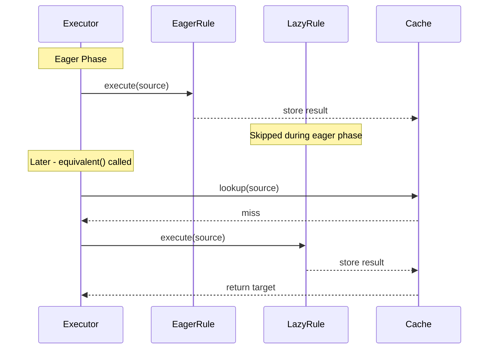

# Lazy Evaluation

**Navigation**: [Documentation Hub](../../index.md) > [Transformation](../index.md) > [User Guide](core-concepts.md) > Lazy Evaluation

Lazy evaluation defers rule execution until the result is actually needed, improving performance for conditionally-used transformations.

## @Lazy Annotation

```java
@TransformRule(name = "Reference2ForeignKey")
@Lazy  // Rule executes only when ctx.equivalent() is called
public TransformFunction<Reference, ForeignKey> reference2ForeignKey() {
    return (ref, ctx) -> {
        ForeignKey fk = ctx.createTarget(ForeignKey.class);
        fk.setName("fk_" + ref.getName());
        fk.setReferencedTable(ctx.equivalent(ref.getTarget(), Table.class));
        return fk;
    };
}
```

## Eager vs Lazy Execution

| Phase | Eager Rules | Lazy Rules |
|-------|-------------|------------|
| Eager Phase | Executed for all source elements | Skipped |
| Lazy Phase | Already cached | Executed on-demand via `equivalent()` |



## When to Use @Lazy

### 1. Conditionally-Needed Transformations

```java
// Only some entities have references - don't transform all upfront
@TransformRule(name = "Reference2ForeignKey")
@Lazy
public TransformFunction<Reference, ForeignKey> reference2ForeignKey() { ... }
```

### 2. Expensive Transformations

```java
// Complex transformation that may not always be needed
@TransformRule(name = "ComplexType2DetailedSchema")
@Lazy
public TransformFunction<ComplexType, DetailedSchema> complexType2DetailedSchema() {
    return (source, ctx) -> {
        // Expensive computation
        DetailedSchema schema = ctx.createTarget(DetailedSchema.class);
        // ... complex logic
        return schema;
    };
}
```

### 3. Circular Reference Handling

```java
// Lazy rules help break circular dependencies
@TransformRule(name = "Entity2Table")
public TransformFunction<EntityType, Table> entity2Table() {
    return (entity, ctx) -> {
        Table table = ctx.createTarget(Table.class);
        // Reference to another entity's table resolved lazily
        if (entity.getRelatedEntity() != null) {
            Table related = ctx.equivalent(entity.getRelatedEntity(), Table.class);
            table.setRelatedTable(related);
        }
        return table;
    };
}
```

## Triggering Lazy Rules

Lazy rules execute when `equivalent()` is called:

```java
@TransformRule(name = "Entity2Table")
public TransformFunction<EntityType, Table> entity2Table() {
    return (entity, ctx) -> {
        Table table = ctx.createTarget(Table.class);
        
        for (Reference ref : entity.getReferences()) {
            // This triggers the lazy Reference2ForeignKey rule
            ForeignKey fk = ctx.equivalent(ref, ForeignKey.class);
            table.getForeignKeys().add(fk);
        }
        
        return table;
    };
}
```

## Caching of Lazy Results

Once executed, lazy rule results are cached:

```java
// First call - executes lazy rule
ForeignKey fk1 = ctx.equivalent(ref, ForeignKey.class);

// Second call - returns cached result (no re-execution)
ForeignKey fk2 = ctx.equivalent(ref, ForeignKey.class);

assert fk1 == fk2;  // Same instance
```

## Lazy with Other Annotations

```java
// Lazy + Guard
@TransformRule(name = "ValidReference2ForeignKey")
@Lazy
@Guard(method = "isValid")
public TransformFunction<Reference, ForeignKey> validReference2ForeignKey() { ... }

// Lazy + Primary
@TransformRule(name = "Reference2MainForeignKey")
@Lazy
@Primary
public TransformFunction<Reference, ForeignKey> reference2MainForeignKey() { ... }
```

## @Detached Annotation

The `@Detached` annotation marks lazy rules whose output should **NOT** be automatically added to `Resource.contents`. The caller is responsible for adding the object to its proper container.

### When to Use @Detached

Use `@Detached` for objects that should only exist within a parent container, not at the resource root:

```java
@TransformRule(name = "TableRowCallAction")
@Lazy
@Detached  // Output NOT added to Resource.contents
public TransformFunction<OperationForm, Action> tableRowCallAction() {
    return (source, ctx) -> {
        Action target = ctx.createTarget(Action.class);
        target.setName(source.getName() + "::TableRowCallAction");
        // Will NOT be added to Resource because @Detached
        return target;
    };
}
```

### Adding Detached Objects to Containers

The caller retrieves the detached object via `equivalent()` or `equivalentDiscriminated()` and adds it to the appropriate container:

```java
@TransformRule(name = "Form2Page")
public TransformFunction<Form, Page> form2Page() {
    return (form, ctx) -> {
        Page page = ctx.createTarget(Page.class);
        page.setName(form.getName());

        // Get detached action - NOT in Resource.contents
        Action action = ctx.equivalentDiscriminated(
            form, Action.class, "TableRowCallAction", "relation1");
        action.setName(action.getName() + "::MyRelation");

        // Caller adds to container
        page.getActions().add(action);

        ctx.addToResource(page);
        return page;
    };
}
```

### ETL Semantics

In Epsilon ETL, lazy rules don't automatically add output to the resource root. The `@Detached` annotation provides the same behavior in ZETA:

| Annotation | createTarget() behavior | Use case |
|------------|------------------------|----------|
| `@Lazy` only | Adds to Resource.contents (if autoAddRootElements=true) | Root-level objects created on-demand |
| `@Lazy @Detached` | Does NOT add to Resource.contents | Child objects that belong in containers |

### Discriminated Equivalence with @Detached

When using `equivalentDiscriminated()` with `@Detached` rules, each discriminated clone is created without being added to the resource:

```java
// Create multiple actions from same source, none added to Resource
Action createAction = ctx.equivalentDiscriminated(
    relation, Action.class, "RelationAction", "create");
createAction.setName(baseName + "::Create");
page.getActions().add(createAction);  // Caller adds

Action updateAction = ctx.equivalentDiscriminated(
    relation, Action.class, "RelationAction", "update");
updateAction.setName(baseName + "::Update");
page.getActions().add(updateAction);  // Caller adds
```

## Performance Benefits

```java
// Without @Lazy: All 1000 references transformed upfront
// With @Lazy: Only referenced References transformed on-demand

// If only 100 of 1000 references are actually used:
// Eager: 1000 transformations
// Lazy: 100 transformations (10x less work)
```

---

**Previous**: [Guards and Conditions](guards-and-conditions.md) | **Next**: [Rule Inheritance](rule-inheritance.md)
