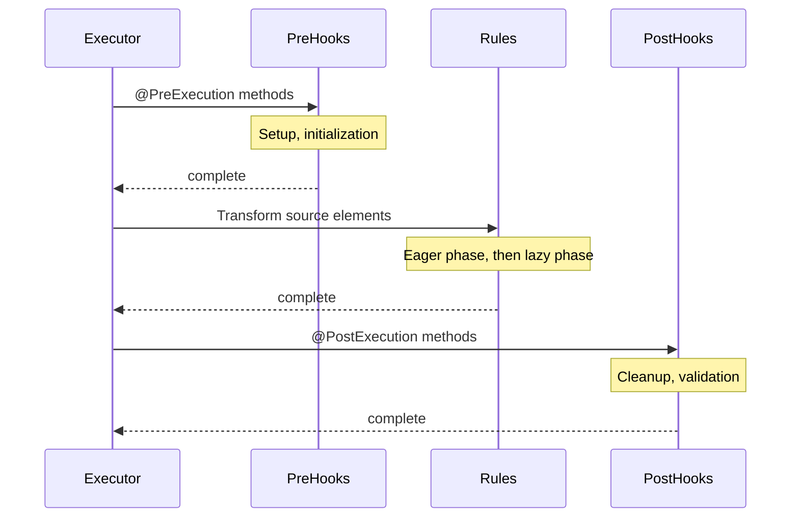

# Lifecycle Hooks

**Navigation**: [Documentation Hub](../../index.md) > [Transformation](../index.md) > [User Guide](core-concepts.md) > Lifecycle Hooks

Lifecycle hooks execute before and after the main transformation phase.

## @PreExecution

Executes before any transformation rules:

```java
@PreExecution
public void setupTransformation(TransformationContext ctx) {
    // Initialize custom attributes
    ctx.setAttribute("entityCount", 0);
    ctx.setAttribute("statistics", new HashMap<String, Integer>());
    
    // Log start
    log.info("Starting transformation...");
}
```

## @PostExecution

Executes after all transformation rules complete:

```java
@PostExecution
public void finalizeTransformation(TransformationContext ctx) {
    // Process statistics
    int count = (int) ctx.getAttribute("entityCount");
    log.info("Transformed {} entities", count);
    
    // Cleanup
    ctx.setAttribute("tempData", null);
    
    // Post-processing on target model
    Collection<Table> tables = ctx.getAllTarget(Table.class);
    for (Table table : tables) {
        if (table.getPrimaryKey() == null) {
            log.warn("Table {} has no primary key", table.getName());
        }
    }
}
```

## Execution Order



## Common Patterns

### Statistics Collection

```java
@PreExecution
public void initStats(TransformationContext ctx) {
    ctx.setAttribute("stats", new TransformationStats());
}

@TransformRule(name = "Entity2Table")
public TransformFunction<EntityType, Table> entity2Table() {
    return (entity, ctx) -> {
        TransformationStats stats = (TransformationStats) ctx.getAttribute("stats");
        stats.incrementEntityCount();
        // ... transformation logic
    };
}

@PostExecution
public void reportStats(TransformationContext ctx) {
    TransformationStats stats = (TransformationStats) ctx.getAttribute("stats");
    log.info("Transformation stats: {}", stats);
}
```

### Target Model Validation

```java
@PostExecution
public void validateTargetModel(TransformationContext ctx) {
    Collection<Table> tables = ctx.getAllTarget(Table.class);
    
    for (Table table : tables) {
        if (table.getColumns().isEmpty()) {
            log.warn("Table {} has no columns", table.getName());
        }
    }
}
```

### Resource Cleanup

```java
@PreExecution
public void openResources(TransformationContext ctx) {
    ctx.setAttribute("connection", openDatabaseConnection());
}

@PostExecution
public void closeResources(TransformationContext ctx) {
    Connection conn = (Connection) ctx.getAttribute("connection");
    if (conn != null) {
        conn.close();
    }
}
```

## Multiple Hooks

Multiple hooks execute in registration order:

```java
@PreExecution
public void firstSetup(TransformationContext ctx) { ... }  // Executes first

@PreExecution
public void secondSetup(TransformationContext ctx) { ... } // Executes second

@PostExecution
public void firstCleanup(TransformationContext ctx) { ... }  // Executes first

@PostExecution
public void secondCleanup(TransformationContext ctx) { ... } // Executes second
```

---

**Previous**: [Discriminated Equivalence](discriminated-equivalence.md) | **Next**: [Extension Methods](extension-methods.md)
