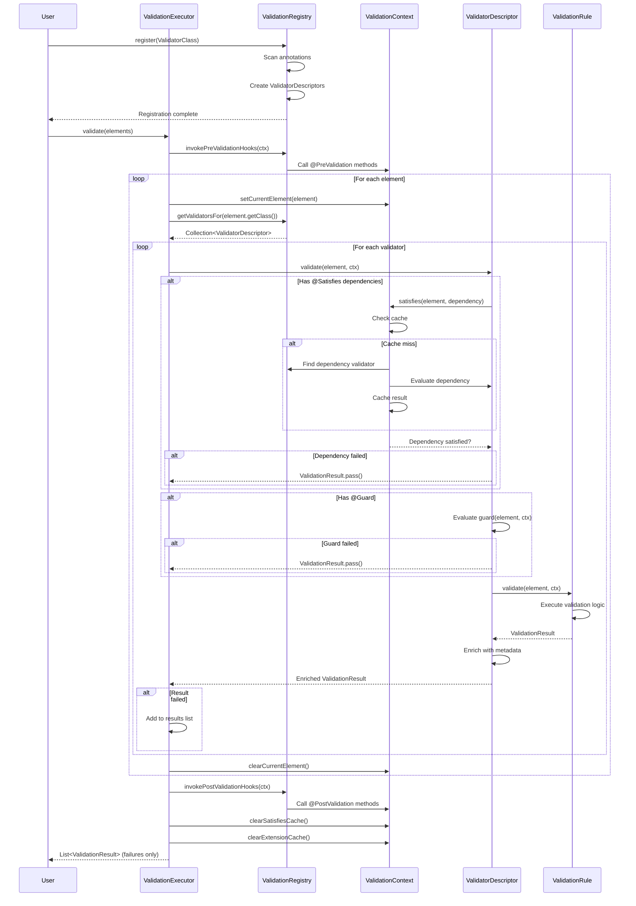
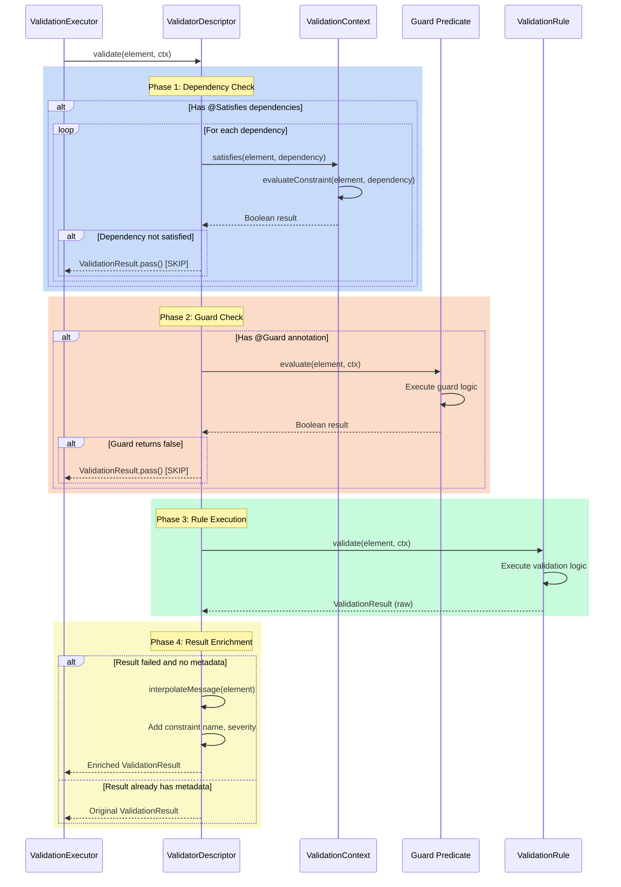
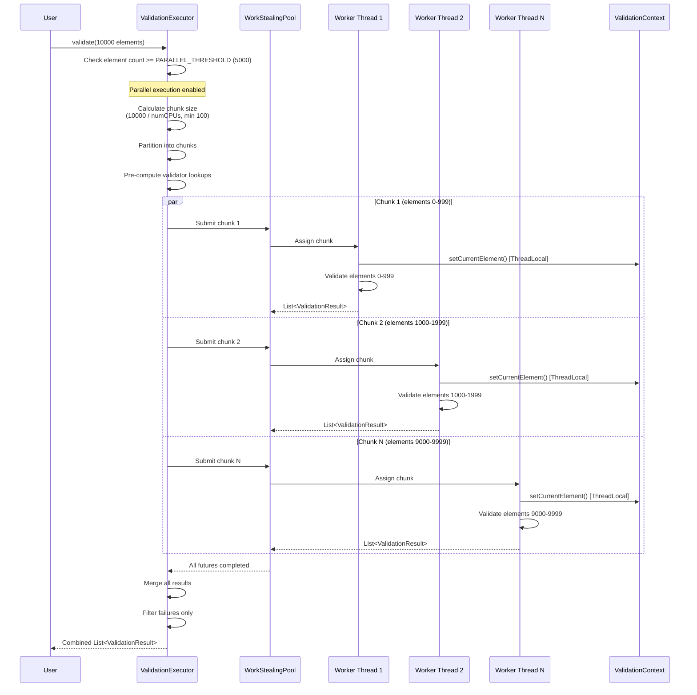
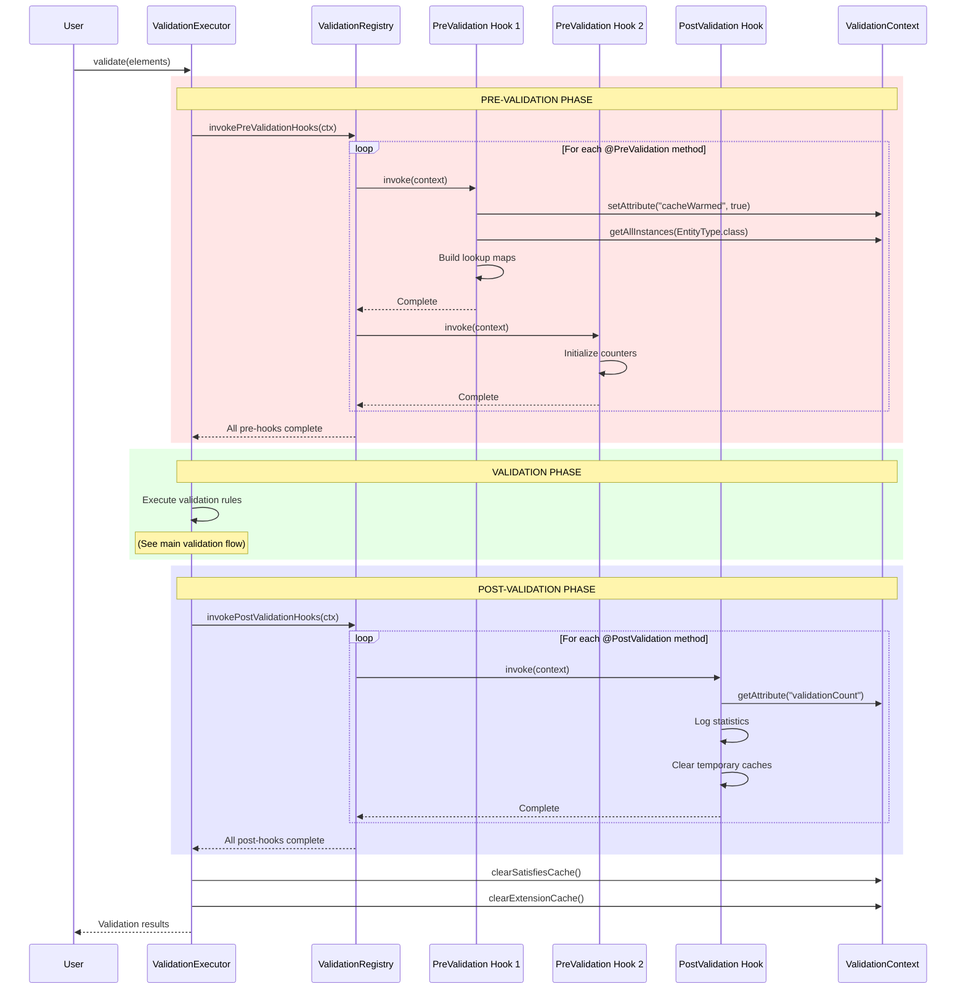

# Validation Execution Flow

**Navigation**: [Documentation Hub](../../index.md) > [Architecture](overview.md) > Execution Flow

This document provides a deep dive into how the Judo Zeta Validation Framework executes validation rules, from initial registration through final result collection. Understanding this flow is essential for debugging complex validation scenarios and optimizing performance.

## Table of Contents

1. [Overview](#overview)
2. [The Five Phases](#the-five-phases)
3. [Detailed Phase Breakdown](#detailed-phase-breakdown)
4. [Sequence Diagrams](#sequence-diagrams)
5. [Rule Execution Flow](#rule-execution-flow)
6. [Pre/Post Validation Hooks](#prepost-validation-hooks)
7. [Order of Operations](#order-of-operations)
8. [Why Order Matters](#why-order-matters)
9. [Thread Safety Considerations](#thread-safety-considerations)
10. [Performance Characteristics](#performance-characteristics)

## Overview

The validation framework operates in five distinct phases that transform annotation-based rule definitions into executed validation results:

```
Registration → Discovery → Dependency Resolution → Execution → Result Collection
```

Each phase has specific responsibilities and guarantees, ensuring predictable and efficient validation execution.

## The Five Phases

### Phase 1: Registration (Classpath Scanning)

**Purpose**: Discover and register all validation rules from annotated classes.

**Key Activities**:
- Scan classes for `@ValidationContext` annotation
- Extract constraint (`@Constraint`) and critique (`@Critique`) methods
- Identify guard methods (`@Guard`)
- Parse dependency declarations (`@Satisfies`)
- Register pre/post validation hooks
- Create `ValidatorDescriptor` metadata objects

**Entry Point**: `ValidationRegistry.register(Class<?>)`

**Output**: Populated registry with descriptors indexed by element type

### Phase 2: Discovery (Finding Applicable Validators)

**Purpose**: For each element being validated, find all applicable validation rules.

**Key Activities**:
- Match element type to registered validators
- Include validators for supertypes
- Include validators for all implemented interfaces
- Cache validator lookups for parallel execution

**Entry Point**: `ValidationRegistry.getValidatorsFor(Class<? extends EObject>)`

**Output**: Collection of `ValidatorDescriptor` objects applicable to element type

### Phase 3: Dependency Resolution (Satisfies Checking)

**Purpose**: Ensure rules execute only when their dependencies are satisfied.

**Key Activities**:
- Check `@Satisfies` dependencies for each rule
- Evaluate prerequisite constraints recursively
- Cache evaluation results to prevent redundant checks
- Detect circular dependencies (breaks loops by assuming satisfaction)

**Entry Point**: `ValidationContext.satisfies(EObject, String)`

**Output**: Boolean indicating whether dependency constraints passed

### Phase 4: Execution (Running Rules)

**Purpose**: Execute validation rules and collect results.

**Key Activities**:
- Evaluate guard predicates
- Execute validation rule logic
- Interpolate message placeholders
- Create enriched `ValidationResult` objects
- Handle exceptions gracefully

**Entry Point**: `ValidatorDescriptor.validate(EObject, ValidationContext)`

**Output**: `ValidationResult` (pass or fail with metadata)

### Phase 5: Result Collection (Aggregation)

**Purpose**: Aggregate results from all rules and filter for failures.

**Key Activities**:
- Collect results from all executed rules
- Filter out passing results (only failures returned)
- Merge results from parallel execution chunks
- Clear caches (satisfies cache, extension method cache)

**Entry Point**: `ValidationExecutor.validate(Collection<? extends EObject>)`

**Output**: List of failed `ValidationResult` objects

## Detailed Phase Breakdown

### Phase 1: Registration in Detail

Registration occurs at framework initialization time, before any validation execution.

```java
public void register(Class<?> validatorClass) {
    // 1. Verify @ValidationContext annotation
    ValidationContext contextAnnotation = validatorClass.getAnnotation(ValidationContext.class);
    if (contextAnnotation == null) {
        log.warn("Class not annotated with @ValidationContext, skipping");
        return;
    }
    
    Class<? extends EObject> contextType = contextAnnotation.value();
    
    // 2. Instantiate validator class
    Object instance = validatorClass.getDeclaredConstructor().newInstance();
    
    // 3. Scan methods for validation annotations
    for (Method method : validatorClass.getDeclaredMethods()) {
        Constraint constraint = method.getAnnotation(Constraint.class);
        Critique critique = method.getAnnotation(Critique.class);
        
        if (constraint != null) {
            registerRule(instance, method, constraint.name(), 
                        constraint.message(), Severity.ERROR, contextType);
        } else if (critique != null) {
            registerRule(instance, method, critique.name(), 
                        critique.message(), Severity.WARNING, contextType);
        }
        
        // 4. Register lifecycle hooks
        if (method.isAnnotationPresent(PreValidation.class)) {
            preValidationHooks.add(method);
            hookInstances.put(method, instance);
        }
        if (method.isAnnotationPresent(PostValidation.class)) {
            postValidationHooks.add(method);
            hookInstances.put(method, instance);
        }
    }
}
```

**Important Details**:

1. **Instance Creation**: Each validator class is instantiated once and reused across all validations
2. **Method Accessibility**: Methods are made accessible via `setAccessible(true)` for reflective invocation
3. **Guard Resolution**: Guard methods are resolved by name and verified to exist
4. **Dependency Parsing**: `@Satisfies` annotations are parsed into string lists
5. **Index Building**: Validators are indexed by element type for fast lookup

### Phase 2: Discovery in Detail

Discovery happens for each unique element type encountered during validation.

```java
public Collection<ValidatorDescriptor> getValidatorsFor(Class<? extends EObject> eClass) {
    List<ValidatorDescriptor> result = new ArrayList<>();
    
    // 1. Get validators for exact type
    result.addAll(validators.getOrDefault(eClass, Collections.emptyList()));
    
    // 2. Get validators for superclasses
    for (Class<?> superType = eClass.getSuperclass();
         superType != null && EObject.class.isAssignableFrom(superType);
         superType = superType.getSuperclass()) {
        result.addAll(validators.getOrDefault(superType, Collections.emptyList()));
    }
    
    // 3. Get validators for interfaces (recursively)
    collectInterfaceValidators(eClass, result);
    
    return result;
}
```

**Type Hierarchy Traversal**:

```
               EObject (interface)
                   ↑
                   |
         NamedElement (interface)
                   ↑
                   |
              EntityType (class)
                   ↑
                   |
           ConcreteEntity (class)
```

When validating a `ConcreteEntity` instance:
1. Validators for `ConcreteEntity` are included
2. Validators for `EntityType` (superclass) are included
3. Validators for `NamedElement` (interface) are included
4. Validators for `EObject` (root interface) are included

This ensures **validation rule inheritance** - subclasses automatically inherit parent validation rules.

### Phase 3: Dependency Resolution in Detail

Dependency resolution uses a three-state cache to prevent infinite recursion and redundant evaluation.

```java
public boolean satisfies(EObject element, String constraintName) {
    CacheKey key = new CacheKey(element, constraintName);
    
    // 1. Check cache
    SatisfiesState cached = satisfiesCache.get(key);
    if (cached != null) {
        switch (cached) {
            case SATISFIED: return true;
            case NOT_SATISFIED: return false;
            case EVALUATING: return true; // Break circular dependency
        }
    }
    
    // 2. Mark as evaluating (circular dependency detection)
    satisfiesCache.put(key, SatisfiesState.EVALUATING);
    
    // 3. Find and evaluate the constraint
    boolean result = evaluateConstraint(element, constraintName);
    
    // 4. Cache the result
    satisfiesCache.put(key, result ? SatisfiesState.SATISFIED : SatisfiesState.NOT_SATISFIED);
    
    return result;
}
```

**Three-State Cache**:

| State | Meaning | Action |
|-------|---------|--------|
| `EVALUATING` | Currently being checked (recursive call detected) | Return `true` to break recursion |
| `SATISFIED` | Constraint passed | Return `true` immediately |
| `NOT_SATISFIED` | Constraint failed or guard failed | Return `false` immediately |

**Circular Dependency Example**:

```java
// RuleA depends on RuleB
@Satisfies(constraints = {"RuleB"})
@Constraint(name = "RuleA", message = "...")
public ValidationRule ruleA() { ... }

// RuleB depends on RuleA (circular!)
@Satisfies(constraints = {"RuleA"})
@Constraint(name = "RuleB", message = "...")
public ValidationRule ruleB() { ... }
```

**Resolution**: When evaluating `RuleA` → checks `RuleB` → checks `RuleA` → detects `EVALUATING` state → returns `true` → breaks loop.

### Phase 4: Execution in Detail

Execution orchestrates guard evaluation, dependency checking, and rule invocation.

```java
public ValidationResult validate(EObject element, ValidationContext ctx) {
    // 1. Check @Satisfies dependencies
    if (!satisfiesDependencies.isEmpty()) {
        for (String dependency : satisfiesDependencies) {
            if (!ctx.satisfies(element, dependency)) {
                // Dependency failed, skip this rule
                return ValidationResult.pass();
            }
        }
    }
    
    // 2. Check guard predicate
    Guard guard = getGuard();
    if (guard != null && !guard.evaluate(element, ctx)) {
        // Guard failed, rule doesn't apply
        return ValidationResult.pass();
    }
    
    // 3. Execute rule logic
    ValidationResult result = getRule().validate(element, ctx);
    
    // 4. Enrich result with metadata
    if (result.isFailed() && result.getConstraintName() == null) {
        return ValidationResult.fail(
            name,
            interpolateMessage(element),
            severity,
            element
        );
    }
    
    return result;
}
```

**Execution Order Within a Single Rule**:

1. **Satisfies Check** → If any dependency fails, return `pass()` (skip rule)
2. **Guard Evaluation** → If guard returns `false`, return `pass()` (rule doesn't apply)
3. **Rule Invocation** → Execute actual validation logic
4. **Result Enrichment** → Add constraint name, interpolated message, severity, context

**Why Return `pass()` for Skipped Rules?**

Skipped rules (due to failed dependencies or guards) return `pass()` rather than a special "skipped" state because:
- They didn't fail validation
- They simply didn't apply to this element
- This simplifies result filtering (only failed results matter)

### Phase 5: Result Collection in Detail

Result collection differs between sequential and parallel execution modes.

**Sequential Execution**:

```java
private List<ValidationResult> validateSequential(Collection<? extends EObject> elements) {
    List<ValidationResult> results = new ArrayList<>();
    
    for (EObject element : elements) {
        try {
            // Set thread-local current element
            context.setCurrentElement(element);
            
            // Get applicable validators
            Collection<ValidatorDescriptor> validators = 
                registry.getValidatorsFor(element.getClass());
            
            // Execute each validator
            for (ValidatorDescriptor validator : validators) {
                if (validator.appliesTo(element)) {
                    ValidationResult result = validator.validate(element, context);
                    if (result.isFailed()) {
                        results.add(result);
                    }
                }
            }
        } finally {
            // Clear thread-local to prevent memory leaks
            context.clearCurrentElement();
        }
    }
    
    return results;
}
```

**Parallel Execution**:

```java
private List<ValidationResult> validateParallel(Collection<? extends EObject> elements) {
    List<EObject> elementList = new ArrayList<>(elements);
    int numProcessors = Runtime.getRuntime().availableProcessors();
    
    // 1. Calculate optimal chunk size
    int chunkSize = Math.max(100, (elementList.size() + numProcessors - 1) / numProcessors);
    
    // 2. Partition elements into chunks
    List<List<EObject>> chunks = partitionList(elementList, chunkSize);
    
    // 3. Pre-compute validator lookups (optimization)
    Map<Class<?>, Collection<ValidatorDescriptor>> validatorCache =
        elementList.stream()
            .map(EObject::getClass)
            .distinct()
            .collect(Collectors.toMap(
                c -> c,
                registry::getValidatorsFor,
                (v1, v2) -> v1
            ));
    
    // 4. Process chunks in parallel using CompletableFuture
    ExecutorService exec = getOrCreateExecutor();
    List<CompletableFuture<List<ValidationResult>>> futures = chunks.stream()
        .map(chunk -> CompletableFuture.supplyAsync(
            () -> validateChunk(chunk, validatorCache),
            exec
        ))
        .collect(Collectors.toList());
    
    // 5. Wait for all chunks and merge results
    return futures.stream()
        .map(CompletableFuture::join)
        .flatMap(List::stream)
        .collect(Collectors.toList());
}
```

**Parallel Execution Optimizations**:

1. **Validator Lookup Caching**: Pre-compute validator lookups before parallel execution to avoid contention on registry
2. **Work-Stealing Pool**: Uses `Executors.newWorkStealingPool()` for automatic load balancing
3. **Chunking Strategy**: Divides work into chunks based on processor count (minimum 100 elements per chunk)
4. **Thread-Local Context**: Each thread has its own current element via `ThreadLocal<EObject>`

## Sequence Diagrams

### Complete Validation Lifecycle



### Rule Execution Flow with Guards and Satisfies



### Parallel Execution Flow



### Pre/Post Validation Hooks



## Rule Execution Flow

### Detailed Rule Execution Steps

When a single rule executes, it goes through a precise sequence of checks and operations:

```
1. ENTRY: ValidatorDescriptor.validate(element, ctx)
   ↓
2. CHECK: @Satisfies dependencies
   ├─ For each dependency:
   │  ├─ Query satisfiesCache[element, dependency]
   │  ├─ If cache miss: Evaluate dependency constraint
   │  ├─ If dependency failed: RETURN ValidationResult.pass() [SKIP RULE]
   │  └─ Cache result
   └─ All dependencies satisfied: CONTINUE
   ↓
3. CHECK: @Guard predicate
   ├─ Invoke guard.evaluate(element, ctx)
   ├─ If guard returns false: RETURN ValidationResult.pass() [SKIP RULE]
   └─ Guard passed or no guard: CONTINUE
   ↓
4. EXECUTE: Validation rule logic
   ├─ Invoke rule.validate(element, ctx)
   ├─ Rule accesses element properties
   ├─ Rule may call ctx.getAllInstances()
   ├─ Rule may call ctx.call() for extension methods
   └─ Rule returns ValidationResult (pass or fail)
   ↓
5. ENRICH: Add metadata to result
   ├─ If result is failed and missing constraint name:
   │  ├─ Set constraintName = this.name
   │  ├─ Interpolate message placeholders ({element.name})
   │  ├─ Set severity = this.severity
   │  └─ Set context = element
   └─ RETURN Enriched ValidationResult
   ↓
6. EXIT: Return to executor
```

### Guard Evaluation Details

Guards are simple predicates that enable conditional validation:

```java
// Guard method signature
private boolean isNotAbstract(
    org.eclipse.emf.ecore.EObject element,
    hu.blackbelt.judo.zeta.validation.core.ValidationContext ctx
) {
    EntityType entity = (EntityType) element;
    return !entity.isAbstract();
}

// Guard is cached per descriptor (lazy initialization)
public Guard getGuard() {
    if (guardMethod == null) {
        return null; // No guard
    }
    
    if (cachedGuard == null) {
        cachedGuard = (element, ctx) -> {
            try {
                return (Boolean) guardMethod.invoke(instance, element, ctx);
            } catch (Exception e) {
                throw new RuntimeException("Failed to evaluate guard for: " + name, e);
            }
        };
    }
    
    return cachedGuard;
}
```

**Guard Characteristics**:

- **Invoked once per element**: Guard is checked before rule execution
- **Access to context**: Guards can query model via `ctx.getAllInstances()`, `ctx.call()`
- **Can depend on other constraints**: Guards can call `ctx.satisfies()` to check prerequisites
- **Cached as lambda**: Guard method is wrapped in a functional interface and cached
- **Fast-fail**: If guard returns `false`, rule doesn't execute at all

### Satisfies Dependency Evaluation

The `@Satisfies` mechanism ensures rules execute in the correct order:

```java
// Example: Rule B depends on Rule A
@Constraint(name = "RuleA", message = "A must be valid")
public ValidationRule ruleA() {
    return (element, ctx) -> {
        // Validate condition A
        return conditionA ? ValidationResult.pass() : ValidationResult.fail("A failed");
    };
}

@Satisfies(constraints = {"RuleA"})
@Constraint(name = "RuleB", message = "B must be valid given A")
public ValidationRule ruleB() {
    return (element, ctx) -> {
        // This only runs if RuleA passed
        // Safe to assume condition A is true here
        return conditionB ? ValidationResult.pass() : ValidationResult.fail("B failed");
    };
}
```

**Execution Sequence**:

```
Element X enters validation
  ↓
RuleA executes for Element X
  ├─ Condition A is TRUE
  └─ Result: PASS (cached as SATISFIED)
  ↓
RuleB starts execution for Element X
  ├─ Check @Satisfies: "RuleA"
  ├─ Query cache: satisfies(ElementX, "RuleA")
  ├─ Cache hit: SATISFIED
  └─ Continue to execute RuleB
  ↓
RuleB logic executes
  └─ Result: PASS or FAIL
```

**If RuleA fails**:

```
Element Y enters validation
  ↓
RuleA executes for Element Y
  ├─ Condition A is FALSE
  └─ Result: FAIL (cached as NOT_SATISFIED)
  ↓
RuleB starts execution for Element Y
  ├─ Check @Satisfies: "RuleA"
  ├─ Query cache: satisfies(ElementY, "RuleA")
  ├─ Cache hit: NOT_SATISFIED
  └─ SKIP RULE (return pass immediately)
  ↓
RuleB does NOT execute
```

**Key Insight**: Dependencies prevent cascading failures. If a prerequisite rule fails, dependent rules skip execution rather than reporting additional failures.

## Pre/Post Validation Hooks

Lifecycle hooks provide setup and teardown capabilities around the validation cycle.

### Pre-Validation Hook Execution

```java
@ValidationContext(EntityType.class)
public class EntityTypeValidations {
    
    private Map<String, EntityType> nameIndex;
    
    @PreValidation
    public void buildNameIndex(ValidationContext ctx) {
        // Runs once before ANY validation rules execute
        Collection<EntityType> allEntities = ctx.getAllInstances(EntityType.class);
        
        nameIndex = allEntities.stream()
            .filter(e -> e.getName() != null)
            .collect(Collectors.toMap(
                EntityType::getName,
                Function.identity(),
                (e1, e2) -> e1 // Keep first on collision
            ));
        
        ctx.setAttribute("entityNameIndex", nameIndex);
        log.info("Built name index with {} entries", nameIndex.size());
    }
    
    @Constraint(name = "NameMustBeUnique", message = "Name must be unique")
    public ValidationRule nameMustBeUnique() {
        return (element, ctx) -> {
            // Use pre-built index instead of scanning all entities each time
            Map<String, EntityType> index = ctx.getAttribute("entityNameIndex");
            EntityType entity = (EntityType) element;
            EntityType existing = index.get(entity.getName());
            
            return existing == element
                ? ValidationResult.pass()
                : ValidationResult.fail("Duplicate name: " + entity.getName());
        };
    }
}
```

**Pre-Validation Use Cases**:

1. **Build lookup indexes**: Create maps for fast cross-element validation
2. **Warm caches**: Pre-compute expensive values used across multiple rules
3. **Initialize counters**: Set up statistics collection
4. **Validate model consistency**: Check global invariants before rule execution
5. **Set context attributes**: Share data between hooks and rules

### Post-Validation Hook Execution

```java
@ValidationContext(EntityType.class)
public class EntityTypeValidations {
    
    @PostValidation
    public void cleanup(ValidationContext ctx) {
        // Runs after ALL validation rules complete
        
        // Log statistics
        Map<String, EntityType> index = ctx.getAttribute("entityNameIndex");
        log.info("Validated {} entities", index.size());
        
        // Clear temporary data
        ctx.setAttribute("entityNameIndex", null);
        
        // Additional cleanup
        // ...
    }
}
```

**Post-Validation Use Cases**:

1. **Log statistics**: Report validation metrics and performance
2. **Clear temporary caches**: Free memory from pre-validation setup
3. **Generate reports**: Create summaries of validation results
4. **Cleanup resources**: Close connections or release locks
5. **Trigger follow-up actions**: Send notifications, update databases

### Hook Execution Guarantees

1. **All pre-hooks run before any rules**: Guaranteed setup phase
2. **All post-hooks run after all rules**: Guaranteed cleanup phase
3. **Hooks run in registration order**: Deterministic sequence
4. **Exceptions don't stop validation**: Logged but don't abort execution
5. **Context is shared**: Same `ValidationContext` instance across hooks and rules

## Order of Operations

### Complete Validation Execution Order

```
1. USER CALL: executor.validate(elements)
   ↓
2. CLEAR: ctx.clearSatisfiesCache()
   ↓
3. PRE-HOOKS: registry.invokePreValidationHooks(ctx)
   ├─ Execute all @PreValidation methods in registration order
   └─ Exceptions logged, execution continues
   ↓
4. EXECUTION MODE DECISION
   ├─ If elements.size() >= PARALLEL_THRESHOLD (5000):
   │  └─ GOTO: Parallel Execution Path
   └─ Else:
      └─ GOTO: Sequential Execution Path
   
   ┌─────────────────────────────────────────┐
   │ SEQUENTIAL EXECUTION PATH               │
   └─────────────────────────────────────────┘
   
5. SEQUENTIAL LOOP: For each element in elements
   ├─ ctx.setCurrentElement(element)
   ├─ descriptors = registry.getValidatorsFor(element.getClass())
   ├─ For each descriptor in descriptors:
   │  ├─ If descriptor.appliesTo(element):
   │  │  ├─ result = descriptor.validate(element, ctx)
   │  │  └─ If result.isFailed(): results.add(result)
   │  └─ Continue
   ├─ ctx.clearCurrentElement()
   └─ Continue to next element
   ↓
   GOTO: Post-Processing
   
   ┌─────────────────────────────────────────┐
   │ PARALLEL EXECUTION PATH                 │
   └─────────────────────────────────────────┘
   
5. CHUNK PREPARATION
   ├─ Calculate chunk size: max(100, elements.size() / numCPUs)
   ├─ Partition elements into chunks
   └─ Pre-compute validatorCache[elementType] = descriptors
   ↓
6. PARALLEL DISPATCH
   ├─ For each chunk:
   │  └─ Submit CompletableFuture.supplyAsync(() -> validateChunk(chunk))
   └─ Wait for all futures to complete
   ↓
7. CHUNK VALIDATION (in parallel threads)
   ├─ For each element in chunk:
   │  ├─ ctx.setCurrentElement(element) [ThreadLocal]
   │  ├─ descriptors = validatorCache.get(element.getClass())
   │  ├─ For each descriptor in descriptors:
   │  │  ├─ If descriptor.appliesTo(element):
   │  │  │  ├─ result = descriptor.validate(element, ctx)
   │  │  │  └─ If result.isFailed(): chunkResults.add(result)
   │  │  └─ Continue
   │  ├─ ctx.clearCurrentElement()
   │  └─ Continue to next element in chunk
   └─ Return chunkResults
   ↓
8. RESULT MERGING
   ├─ Merge all chunk results into single list
   └─ Continue to Post-Processing
   
   ┌─────────────────────────────────────────┐
   │ POST-PROCESSING (both paths)            │
   └─────────────────────────────────────────┘
   
9. POST-HOOKS: registry.invokePostValidationHooks(ctx)
   ├─ Execute all @PostValidation methods in registration order
   └─ Exceptions logged, execution continues
   ↓
10. CLEANUP
    ├─ ctx.clearSatisfiesCache()
    ├─ ctx.clearExtensionCache()
    └─ Filter results (only failures)
    ↓
11. RETURN: List<ValidationResult> (failures only)
```

### Rule-Level Execution Order

Within a single rule execution:

```
1. ENTRY: descriptor.validate(element, ctx)
   ↓
2. SATISFIES CHECK
   ├─ For each dependency in @Satisfies:
   │  ├─ satisfied = ctx.satisfies(element, dependency)
   │  └─ If !satisfied: RETURN ValidationResult.pass() [EARLY EXIT]
   └─ All dependencies satisfied: CONTINUE
   ↓
3. GUARD CHECK
   ├─ If @Guard annotation present:
   │  ├─ guardResult = guard.evaluate(element, ctx)
   │  └─ If !guardResult: RETURN ValidationResult.pass() [EARLY EXIT]
   └─ No guard or guard passed: CONTINUE
   ↓
4. RULE EXECUTION
   ├─ rule = descriptor.getRule() [lazy init + cache]
   ├─ result = rule.validate(element, ctx)
   └─ Continue
   ↓
5. RESULT ENRICHMENT
   ├─ If result.isFailed() && result.getConstraintName() == null:
   │  ├─ constraintName = descriptor.getName()
   │  ├─ message = interpolateMessage(element)
   │  ├─ severity = descriptor.getSeverity()
   │  ├─ context = element
   │  └─ Create enriched ValidationResult
   └─ Else: Use original result
   ↓
6. RETURN: ValidationResult
```

## Why Order Matters

### 1. Dependency-Driven Execution Order

**Problem**: Without dependency ordering, rules execute in arbitrary order, causing:
- Cascading failures (one root cause, many reported errors)
- Null pointer exceptions (assuming prerequisites passed)
- Confusing error messages (dependent rules fail when prerequisite data is invalid)

**Solution**: `@Satisfies` ensures rules execute only when prerequisites pass.

**Example**:

```java
// BAD: No dependency declaration
@Constraint(name = "NameMustBeUnique", message = "Name must be unique")
public ValidationRule nameMustBeUnique() {
    return (element, ctx) -> {
        EntityType entity = (EntityType) element;
        String name = entity.getName(); // Might be null!
        
        long count = ctx.getAllInstances(EntityType.class).stream()
            .filter(e -> name.equals(e.getName())) // NullPointerException if name is null
            .count();
        
        return count == 1 ? ValidationResult.pass() : ValidationResult.fail("Duplicate name");
    };
}

// GOOD: Dependency declared
@Satisfies(constraints = {"EntityMustHaveName"})
@Constraint(name = "NameMustBeUnique", message = "Name must be unique")
public ValidationRule nameMustBeUnique() {
    return (element, ctx) -> {
        EntityType entity = (EntityType) element;
        // Safe to access getName() - EntityMustHaveName already verified it's not null
        String name = entity.getName();
        
        long count = ctx.getAllInstances(EntityType.class).stream()
            .filter(e -> name.equals(e.getName()))
            .count();
        
        return count == 1 ? ValidationResult.pass() : ValidationResult.fail("Duplicate name");
    };
}
```

### 2. Pre-Hook Execution Before Rules

**Problem**: If rules execute before pre-hooks, they can't use pre-built indexes or caches.

**Solution**: Pre-hooks always execute before any rules.

**Example**:

```java
@PreValidation
public void buildLookupMaps(ValidationContext ctx) {
    // Build expensive lookup structures once
    Map<String, EntityType> nameMap = ...;
    ctx.setAttribute("nameMap", nameMap);
}

@Constraint(name = "NameMustBeUnique", message = "Name must be unique")
public ValidationRule nameMustBeUnique() {
    return (element, ctx) -> {
        // Pre-hook guaranteed to have run, nameMap is available
        Map<String, EntityType> nameMap = ctx.getAttribute("nameMap");
        // Use pre-built map instead of scanning all entities
    };
}
```

### 3. Guard Evaluation Before Rule Execution

**Problem**: If guards evaluate after rule execution, unnecessary work is performed.

**Solution**: Guards evaluate before rule logic, enabling fast-fail.

**Example**:

```java
// Guard checks if element is abstract
private boolean isNotAbstract(EObject element, ValidationContext ctx) {
    return !((EntityType) element).isAbstract();
}

// Rule only runs for non-abstract entities
@Guard(method = "isNotAbstract")
@Constraint(name = "MustHaveTable", message = "Must have table")
public ValidationRule mustHaveTable() {
    return (element, ctx) -> {
        // Expensive validation logic
        // Only runs if isNotAbstract() returned true
    };
}
```

### 4. Cache Clearing After Validation

**Problem**: If caches aren't cleared between validation runs, stale data causes incorrect results.

**Solution**: Caches are cleared in `finally` block, guaranteed to run.

```java
public List<ValidationResult> validate(Collection<? extends EObject> elements) {
    context.clearSatisfiesCache(); // Clear before validation
    
    registry.invokePreValidationHooks(context);
    
    try {
        // Validation execution
        return useParallel ? validateParallel(elements) : validateSequential(elements);
    } finally {
        // Always runs, even if exception thrown
        registry.invokePostValidationHooks(context);
        context.clearSatisfiesCache();     // Clear after validation
        context.clearExtensionCache();     // Clear extension method cache
    }
}
```

### 5. ThreadLocal Current Element in Parallel Execution

**Problem**: In parallel execution, multiple threads validate different elements simultaneously. Sharing a single `currentElement` field causes race conditions.

**Solution**: Use `ThreadLocal<EObject>` so each thread has its own current element.

```java
// Thread-local storage for current element
private final ThreadLocal<EObject> currentElement = new ThreadLocal<>();

public EObject getCurrentElement() {
    return currentElement.get(); // Each thread gets its own value
}

public void setCurrentElement(EObject element) {
    this.currentElement.set(element); // Sets value for this thread only
}

public void clearCurrentElement() {
    this.currentElement.remove(); // Prevents memory leaks
}
```

**Why This Matters**:

Without `ThreadLocal`:
```
Thread 1: setCurrentElement(EntityA)
Thread 2: setCurrentElement(EntityB)  [overwrites Thread 1's value]
Thread 1: getCurrentElement()         [gets EntityB instead of EntityA - BUG!]
```

With `ThreadLocal`:
```
Thread 1: setCurrentElement(EntityA)  [stored in Thread 1's local storage]
Thread 2: setCurrentElement(EntityB)  [stored in Thread 2's local storage]
Thread 1: getCurrentElement()         [gets EntityA - correct!]
Thread 2: getCurrentElement()         [gets EntityB - correct!]
```

## Thread Safety Considerations

### Thread-Safe Components

| Component | Thread Safety | Mechanism |
|-----------|---------------|-----------|
| `ValidationRegistry` | Read-only after initialization | No synchronization needed |
| `ValidatorDescriptor` | Immutable metadata, cached lambdas | Safe for concurrent reads |
| `ValidationContext` | ThreadLocal current element, ConcurrentHashMap caches | Thread-safe |
| `ExtensionMethodRegistry` | ConcurrentHashMap cache | Thread-safe |
| `ValidationExecutor` | Stateless execution, ThreadLocal context | Thread-safe |

### Concurrent Data Structures

```java
// ValidationContext uses ConcurrentHashMap for caches
private final Map<CacheKey, SatisfiesState> satisfiesCache = new ConcurrentHashMap<>();
private final Map<String, Object> attributes = new ConcurrentHashMap<>();

// ExtensionMethodRegistry uses ConcurrentHashMap
private final Map<CacheKey, Object> cache = new ConcurrentHashMap<>();
```

**Why ConcurrentHashMap?**

- Allows concurrent reads without locking
- Allows concurrent writes with fine-grained locking
- `computeIfAbsent()` is atomic - prevents duplicate computation

### Memory Leak Prevention

```java
// Always clear ThreadLocal to prevent memory leaks
try {
    context.setCurrentElement(element);
    // Validate element
} finally {
    context.clearCurrentElement(); // Remove ThreadLocal value
}
```

**Why This Matters**:

Thread pools reuse threads. Without clearing `ThreadLocal`:
1. Thread 1 validates ElementA, sets `currentElement = ElementA`
2. Thread 1 returns to pool (still has `currentElement = ElementA`)
3. Thread 1 is reused for different task
4. Thread 1 still holds reference to ElementA → ElementA can't be garbage collected → memory leak

## Performance Characteristics

### Sequential Execution

**Time Complexity**: O(E × R)
- E = number of elements
- R = average rules per element

**Space Complexity**: O(E × R)
- Satisfies cache: O(E × R) in worst case
- Extension method cache: Depends on usage

**Best For**:
- Small models (< 5000 elements)
- Models with few elements but complex rules
- Development/debugging (easier to trace)

### Parallel Execution

**Time Complexity**: O((E × R) / P)
- P = number of processors
- Assumes perfect load balancing

**Speedup**: 3-4× on 8-core CPU for typical workloads

**Overhead**:
- Chunking: O(E)
- Validator cache pre-computation: O(T) where T = unique types
- Future creation: O(C) where C = chunk count
- Result merging: O(E × R)

**Best For**:
- Large models (≥ 5000 elements)
- Models with many elements and simple-to-moderate complexity rules
- Production validation runs

### Cache Performance

**Satisfies Cache**:
- Hit rate: 80-95% for models with repeated validations
- Miss penalty: Full constraint evaluation
- Memory: ~50 bytes per cached entry

**Extension Method Cache**:
- Hit rate: Highly dependent on usage pattern
- Miss penalty: Reflection + method invocation
- Memory: Varies by return value size

### Optimization Tips

1. **Use `@Satisfies` liberally**: Prevents redundant validations
2. **Cache expensive computations**: Use `@Cached` on extension methods
3. **Build lookup maps in pre-hooks**: O(1) lookups vs O(n) scans
4. **Enable parallel execution**: 3-4× speedup for large models
5. **Minimize guard complexity**: Guards execute frequently, keep them fast

---

**Previous**: [Architecture Overview](overview.md) | **Next**: [Parallel Execution](parallel-execution.md) | **Up**: [Documentation Hub](../../index.md)
