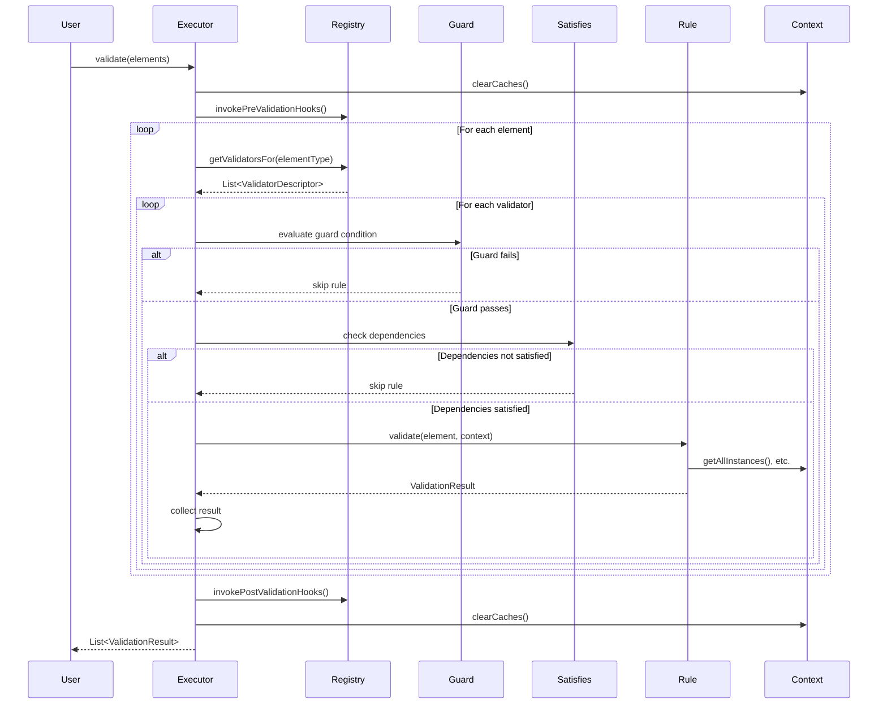

# Core Concepts

**Navigation**: [Documentation Hub](../../index.md) > [Validation](../index.md) > [User Guide](core-concepts.md) > Core Concepts

This guide explains the fundamental concepts of the Judo Zeta Validation Framework.

## Overview

The Judo Zeta Validation Framework provides annotation-based validation for EMF models. Instead of using a domain-specific language (DSL) like EVL, you write validation rules in pure Java using annotations.

### Key Benefits

- **Type Safety** - Compile-time type checking catches errors early
- **IDE Support** - Full autocomplete, refactoring, and debugging
- **Performance** - No interpretation overhead, automatic parallelization
- **Testability** - Standard unit testing for validation rules
- **Maintainability** - Familiar Java code, no DSL to learn

## Core Components

```mermaid
graph TB
    A[@ValidationContext Class] -->|contains| B[@Constraint/@Critique Methods]
    B -->|returns| C[ValidationRule Lambda]
    C -->|uses| D[ValidationContext API]
    C -->|produces| E[ValidationResult]
    F[ValidationRegistry] -->|scans| A
    G[ValidationExecutor] -->|uses| F
    G -->|executes| C
    G -->|collects| E
```

### 1. @ValidationContext

Class-level annotation that declares which EMF element type this class validates.

```java
@ValidationContext(EntityType.class)
public class EntityTypeValidations {
    // All rules in this class validate EntityType instances
}
```

**Key Points**:
- One validation class per element type (usually)
- Can have multiple classes for the same type (rules from all are combined)
- Must be registered with `ValidationRegistry`

### 2. @Constraint and @Critique

Method-level annotations that define validation rules.

| Annotation | Severity | Meaning |
|------------|----------|---------|
| `@Constraint` | ERROR | Must be fixed - model is invalid |
| `@Critique` | WARNING | Should be fixed - model quality issue |

```java
@Constraint(
    name = "EntityMustHaveName",        // Unique identifier
    message = "Entity must have a name"  // Default error message
)
public ValidationRule entityMustHaveName() {
    return (element, ctx) -> {
        // Validation logic here
    };
}

@Critique(
    name = "EntityShouldHaveDescription",
    message = "Entity should have a description"
)
public ValidationRule entityShouldHaveDescription() {
    return (element, ctx) -> {
        // Validation logic here
    };
}
```

### 3. ValidationRule Interface

Functional interface that performs the actual validation:

```java
@FunctionalInterface
public interface ValidationRule {
    ValidationResult validate(EObject element, ValidationContext ctx);
}
```

Most commonly implemented as a lambda:

```java
@Constraint(name = "MustHaveName", message = "...")
public ValidationRule mustHaveName() {
    return (element, ctx) -> {
        MyType obj = (MyType) element;
        
        // Validation logic
        if (obj.getName() == null) {
            return ValidationResult.fail("Name is required");
        }
        
        return ValidationResult.pass();
    };
}
```

### 4. ValidationResult

Immutable value object representing the outcome of a validation:

```java
// Passing result
ValidationResult.pass()

// Failing result with message
ValidationResult.fail("Entity name is required")

// Warning result
ValidationResult.warn("Consider adding a description")

// Full result with all metadata
ValidationResult.fail(
    constraintName,  // Constraint identifier
    message,         // Error message
    Severity.ERROR,  // ERROR or WARNING
    element          // The element that failed
)
```

**Properties**:
- `isValid()` - Returns true if validation passed
- `getSeverity()` - Returns `Severity.ERROR` or `Severity.WARNING`
- `getMessage()` - Returns the error/warning message
- `getConstraintName()` - Returns the constraint identifier
- `getElement()` - Returns the element that was validated

### 5. ValidationContext API

Provides access to the model and validation state during rule execution:

```java
public interface ValidationContext {
    // Get all instances of a type in the model
    <T extends EObject> List<T> getAllInstances(Class<T> type);
    
    // Check if another constraint passed for this element
    boolean satisfies(EObject element, String constraintName);
    
    // Call an extension method (cached)
    <T> T call(EObject target, String methodName, Object... args);
    
    // Cache management (for expensive computations)
    Object getCached(CacheKey key);
    void putCached(CacheKey key, Object value);
    void clearCaches();
}
```

**Common Usage**:

```java
@Constraint(name = "NameMustBeUnique", message = "Name must be unique")
public ValidationRule nameMustBeUnique() {
    return (element, ctx) -> {
        EntityType entity = (EntityType) element;
        
        // Get all instances of EntityType in the model
        List<EntityType> allEntities = ctx.getAllInstances(EntityType.class);
        
        // Check for duplicates
        long count = allEntities.stream()
            .filter(e -> entity.getName().equals(e.getName()))
            .count();
            
        return count == 1
            ? ValidationResult.pass()
            : ValidationResult.fail("Duplicate name: " + entity.getName());
    };
}
```

### 6. ValidationRegistry

Central registry for validation classes. Scans classes for annotations and builds validation descriptors.

```java
ValidationRegistry registry = new ValidationRegistry();

// Register individual classes
registry.register(EntityTypeValidations.class);
registry.register(AttributeValidations.class);
registry.register(OperationValidations.class);

// Or register packages (scans all classes)
registry.scanPackage("com.example.validation");
```

### 7. ValidationExecutor

Executes validation rules and collects results.

```java
ValidationExecutor executor = ValidationExecutor.builder()
    .registry(registry)
    .parallelThreshold(5000)  // Optional: parallel execution threshold
    .chunkSize(100)           // Optional: work unit size for parallel execution
    .build();

List<ValidationResult> results = executor.validate(modelElements);
```

**Execution Flow**:
1. Invoke pre-validation hooks (`@PreValidation`)
2. For each element:
   - Find applicable validators from registry
   - Evaluate guards
   - Check `@Satisfies` dependencies
   - Execute validation rule
   - Collect result
3. Invoke post-validation hooks (`@PostValidation`)
4. Return all results

## Validation Rule Lifecycle



## Annotation Summary

| Annotation | Level | Purpose |
|------------|-------|---------|
| `@ValidationContext` | Class | Declares the element type this class validates |
| `@Constraint` | Method | Defines an error-level validation rule |
| `@Critique` | Method | Defines a warning-level validation rule |
| `@Guard` | Method | Adds a conditional guard to a rule |
| `@Satisfies` | Method | Declares dependencies on other constraints |
| `@Cached` | Method | Caches the result of expensive computations |
| `@ExtensionMethod` | Method | Defines a reusable helper method |
| `@PreValidation` | Method | Hook executed before validation starts |
| `@PostValidation` | Method | Hook executed after validation completes |

## Severity Levels

```java
public enum Severity {
    ERROR,    // @Constraint - Must be fixed, model is invalid
    WARNING   // @Critique - Should be fixed, quality issue
}
```

**When to use ERROR vs WARNING**:

| Use ERROR (@Constraint) | Use WARNING (@Critique) |
|-------------------------|-------------------------|
| Name is null/empty | Name doesn't follow convention |
| Required reference is missing | Optional description is missing |
| Type violation | Style guide violation |
| Cyclic dependency detected | Performance concern |
| Constraint prevents code generation | Documentation recommendation |

## Working with EMF Types

The framework works seamlessly with EMF:

```java
@ValidationContext(EntityType.class)
public class EntityTypeValidations {
    
    @Constraint(name = "ValidSupertype", message = "...")
    public ValidationRule validSupertype() {
        return (element, ctx) -> {
            EntityType entity = (EntityType) element;
            
            // Access EMF features
            String name = entity.getName();
            EntityType superType = entity.getSuperType();
            EList<Attribute> attributes = entity.getAttributes();
            EObject container = entity.eContainer();
            
            // Check EMF metadata
            if (entity.eIsProxy()) {
                return ValidationResult.fail("Element is an unresolved proxy");
            }
            
            // Traverse relationships
            if (superType != null && !superType.isAbstract()) {
                return ValidationResult.fail("Supertype must be abstract");
            }
            
            return ValidationResult.pass();
        };
    }
}
```

## Error Message Best Practices

Good error messages help users fix problems quickly:

```java
// ❌ Bad: Vague message
return ValidationResult.fail("Invalid");

// ❌ Bad: No context
return ValidationResult.fail("Name is required");

// ✅ Good: Specific with context
return ValidationResult.fail(
    "Entity '" + entity.getName() + "' must have a name"
);

// ✅ Good: Actionable guidance
return ValidationResult.fail(
    "Entity '" + entity.getName() + "' has circular inheritance. " +
    "Remove '" + superType.getName() + "' from the inheritance chain."
);
```

See [Error Messages Best Practices](../best-practices/error-messages.md) for more details.

## Next Steps

- **[Writing Validation Rules](validation-rules.md)** - Learn advanced rule patterns
- **[Guards and Dependencies](guards-and-dependencies.md)** - Master conditional validation
- **[Examples](../examples/simple-validations.md)** - See real-world examples

## Related Topics

- [Getting Started](../getting-started.md) - Installation and first validation
- [Annotations Reference](../reference/annotations.md) - Complete annotation documentation
- [ValidationContext API](../reference/validation-context.md) - Full API reference

---

**Previous**: [Getting Started](../getting-started.md) | **Next**: [Writing Validation Rules](validation-rules.md)
