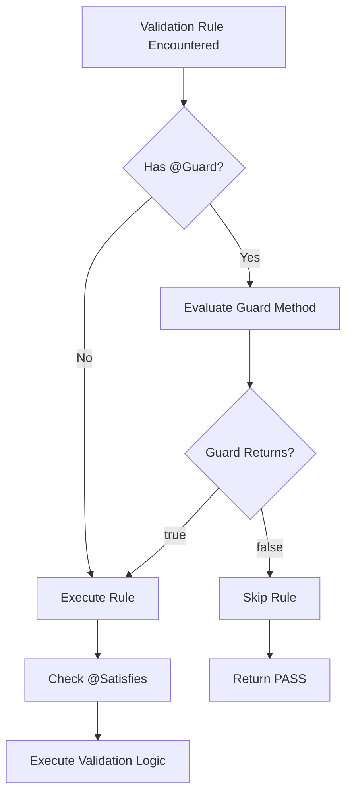

# Guards and Dependencies

**Navigation**: [Documentation Hub](../../index.md) > [Validation](../index.md) > [User Guide](core-concepts.md) > Guards and Dependencies

This guide covers conditional validation with guards and dependency management with the `@Satisfies` annotation.

## Overview

The Judo Zeta Validation Framework provides two powerful mechanisms for controlling when validation rules execute:

- **@Guard** - Conditional execution based on element properties
- **@Satisfies** - Dependency-based execution order and prerequisite checking

These features enable you to:
- Skip validation rules that don't apply to certain elements
- Ensure rules run in the correct order
- Avoid cascading errors when prerequisites fail
- Build complex validation chains

## Guard Annotation

### Basic Concept

A **guard** is a predicate function that determines whether a validation rule should execute. If the guard returns `false`, the validation is skipped entirely.

Think of guards as "applicability filters" - they answer the question: "Does this rule apply to this specific element?"

### Guard Method Signature

Guard methods must follow this exact signature:

```java
public boolean guardMethodName(EObject element, ValidationContext ctx) {
    // Return true to execute the rule, false to skip
}
```

**Parameters**:
- `element` - The element being validated (typed as `EObject`, cast to your specific type)
- `ctx` - The validation context (provides access to model, satisfies checks, etc.)

**Return value**:
- `true` - Guard passes, execute the validation rule
- `false` - Guard fails, skip the validation rule

### Basic Guard Example

```java
@ValidationContext(EntityType.class)
public class EntityTypeValidations {
    
    @Constraint(name = "ConcreteMustHaveTable", message = "Concrete entity must have table")
    @Guard(method = "isNotAbstract")
    public ValidationRule concreteMustHaveTable() {
        return (element, ctx) -> {
            EntityType entity = (EntityType) element;
            // This only runs if isNotAbstract returns true
            return entity.getTable() != null
                ? ValidationResult.pass()
                : ValidationResult.fail("Concrete entity requires a table mapping");
        };
    }
    
    public boolean isNotAbstract(EObject element, ValidationContext ctx) {
        EntityType entity = (EntityType) element;
        return !entity.isAbstract();
    }
}
```

In this example:
- The `ConcreteMustHaveTable` rule only runs for non-abstract entities
- Abstract entities are skipped entirely - they don't need table mappings
- The guard prevents unnecessary validation and confusing error messages

### Guard Patterns

#### 1. Property-Based Guards

Check element properties to determine applicability:

```java
@Constraint(name = "MappedEntityMustHaveBinding", message = "...")
@Guard(method = "isMapped")
public ValidationRule mappedEntityMustHaveBinding() {
    return (element, ctx) -> {
        EntityType entity = (EntityType) element;
        return entity.getBinding() != null
            ? ValidationResult.pass()
            : ValidationResult.fail("Mapped entity requires binding");
    };
}

public boolean isMapped(EObject element, ValidationContext ctx) {
    EntityType entity = (EntityType) element;
    return entity.getMapping() != null;
}
```

#### 2. Relationship-Based Guards

Check related elements:

```java
@Constraint(name = "OperationMustHaveBody", message = "...")
@Guard(method = "isNotAbstract")
public ValidationRule operationMustHaveBody() {
    return (element, ctx) -> {
        Operation operation = (Operation) element;
        return operation.getBody() != null
            ? ValidationResult.pass()
            : ValidationResult.fail("Non-abstract operation requires implementation");
    };
}

public boolean isNotAbstract(EObject element, ValidationContext ctx) {
    Operation operation = (Operation) element;
    EntityType owner = (EntityType) operation.eContainer();
    // Operation is abstract if its owner is abstract
    return owner != null && !owner.isAbstract();
}
```

#### 3. Context-Based Guards

Use the validation context to check other elements:

```java
@Constraint(name = "PrimaryKeyRequired", message = "...")
@Guard(method = "hasContainer")
public ValidationRule primaryKeyRequired() {
    return (element, ctx) -> {
        // Validation logic
    };
}

public boolean hasContainer(EObject element, ValidationContext ctx) {
    // Only validate if element is within a specific container
    return element.eContainer() != null;
}
```

#### 4. Complex Guards with satisfies()

Guards can check if other constraints are satisfied:

```java
@Constraint(name = "ValidBinding", message = "...")
@Guard(method = "hasValidMapping")
public ValidationRule validBinding() {
    return (element, ctx) -> {
        // This only runs if MappingIsValid constraint passes
    };
}

public boolean hasValidMapping(EObject element, ValidationContext ctx) {
    // Check if prerequisite constraint is satisfied
    return ctx.satisfies(element, "MappingIsValid");
}
```

### Guard Execution Flow



**Important**: When a guard fails, the rule returns `ValidationResult.pass()` - it's not a failure, just "not applicable".

## Satisfies Annotation

### Basic Concept

The `@Satisfies` annotation declares that a validation rule **depends on other constraints** being satisfied first.

This is inspired by the **Epsilon Validation Language (EVL)** concept of "satisfies", which prevents cascading errors and ensures logical execution order.

### How Satisfies Works

When you annotate a rule with `@Satisfies`:

```java
@Constraint(name = "NameMustBeUnique", message = "...")
@Satisfies(constraints = {"EntityMustHaveName"})
public ValidationRule nameMustBeUnique() {
    return (element, ctx) -> {
        // This only runs if EntityMustHaveName passes
        EntityType entity = (EntityType) element;
        List<EntityType> all = ctx.getAllInstances(EntityType.class);
        
        long count = all.stream()
            .filter(e -> entity.getName().equals(e.getName()))
            .count();
            
        return count == 1
            ? ValidationResult.pass()
            : ValidationResult.fail("Duplicate name: " + entity.getName());
    };
}
```

**Execution behavior**:
1. Before `NameMustBeUnique` runs, the framework checks if `EntityMustHaveName` passed
2. If `EntityMustHaveName` failed, `NameMustBeUnique` is **skipped**
3. If `EntityMustHaveName` passed, `NameMustBeUnique` executes normally

**Why this matters**: If the entity doesn't have a name at all (null), there's no point checking if the name is unique. You'd get a `NullPointerException` or confusing error message. By declaring the dependency, you avoid cascading failures.

### Multiple Dependencies

You can depend on multiple constraints:

```java
@Constraint(name = "OperationSignatureValid", message = "...")
@Satisfies(constraints = {"OperationHasName", "OperationHasReturnType", "OperationHasOwner"})
public ValidationRule operationSignatureValid() {
    return (element, ctx) -> {
        // Only runs if all three dependencies pass
        Operation op = (Operation) element;
        // Can safely assume name, returnType, and owner are not null
    };
}
```

### Dependency Chains

Dependencies can form chains - rule C depends on B, B depends on A:

```java
@ValidationContext(Operation.class)
public class OperationValidations {
    
    // Level 1: Basic existence checks (no dependencies)
    @Constraint(name = "OperationMustHaveName", message = "Operation must have a name")
    public ValidationRule operationMustHaveName() {
        return (element, ctx) -> {
            Operation op = (Operation) element;
            return op.getName() != null && !op.getName().isEmpty()
                ? ValidationResult.pass()
                : ValidationResult.fail("Operation name is required");
        };
    }
    
    @Constraint(name = "OperationMustBelongToEntity", message = "Operation must belong to entity")
    public ValidationRule operationMustBelongToEntity() {
        return (element, ctx) -> {
            Operation op = (Operation) element;
            return op.eContainer() instanceof EntityType
                ? ValidationResult.pass()
                : ValidationResult.fail("Operation must be owned by an EntityType");
        };
    }
    
    // Level 2: Depends on basic checks
    @Constraint(name = "OperationNameMustBeUnique", message = "Operation name must be unique")
    @Satisfies(constraints = {"OperationMustHaveName", "OperationMustBelongToEntity"})
    public ValidationRule operationNameMustBeUnique() {
        return (element, ctx) -> {
            Operation op = (Operation) element;
            EntityType owner = (EntityType) op.eContainer();
            
            long count = owner.getOperations().stream()
                .filter(o -> op.getName().equals(o.getName()))
                .count();
                
            return count == 1
                ? ValidationResult.pass()
                : ValidationResult.fail("Duplicate operation name: " + op.getName());
        };
    }
    
    // Level 3: Depends on level 2
    @Constraint(name = "OperationOverrideValid", message = "Operation override must be valid")
    @Satisfies(constraints = {"OperationNameMustBeUnique"})
    public ValidationRule operationOverrideValid() {
        return (element, ctx) -> {
            // Only runs if name is unique
            // Check override rules
        };
    }
}
```

**Execution order**:
1. `OperationMustHaveName` and `OperationMustBelongToEntity` (no dependencies)
2. `OperationNameMustBeUnique` (depends on level 1)
3. `OperationOverrideValid` (depends on level 2)

### The satisfies() Method

The `ValidationContext` provides a `satisfies()` method to check if a constraint passed:

```java
/**
 * Check if a constraint is satisfied for the current element.
 */
public boolean satisfies(String constraintName)

/**
 * Check if a constraint is satisfied for ANY element.
 */
public boolean satisfies(EObject element, String constraintName)

/**
 * Check if ALL elements in a collection satisfy a constraint.
 */
public boolean allSatisfy(Collection<? extends EObject> elements, String constraintName)
```

#### Using satisfies() in Validation Logic

You can use `satisfies()` directly in your validation rules:

```java
@Constraint(name = "AllReferencesMustBeValid", message = "...")
public ValidationRule allReferencesMustBeValid() {
    return (element, ctx) -> {
        EntityType entity = (EntityType) element;
        List<Reference> refs = entity.getReferences();
        
        // Check if all referenced types satisfy their own constraints
        for (Reference ref : refs) {
            EntityType target = ref.getTarget();
            if (!ctx.satisfies(target, "EntityTypeIsValid")) {
                return ValidationResult.fail(
                    "Reference points to invalid entity: " + target.getName()
                );
            }
        }
        
        return ValidationResult.pass();
    };
}
```

#### Using satisfies() in Guards

Combine guards with satisfies checks:

```java
@Constraint(name = "BindingMustMatchMapping", message = "...")
@Guard(method = "hasSatisfiedMapping")
public ValidationRule bindingMustMatchMapping() {
    return (element, ctx) -> {
        // Only runs if MappingIsValid passed
    };
}

public boolean hasSatisfiedMapping(EObject element, ValidationContext ctx) {
    EntityType entity = (EntityType) element;
    return entity.getMapping() != null 
        && ctx.satisfies(entity, "MappingIsValid");
}
```

### Satisfies Caching

The framework caches `satisfies()` results for performance:

```java
// First call: executes the constraint validation
boolean result1 = ctx.satisfies(entity, "EntityMustHaveName");

// Second call: returns cached result (no re-execution)
boolean result2 = ctx.satisfies(entity, "EntityMustHaveName");
```

**Cache behavior**:
- Cache is cleared at the start of each validation run
- Cache prevents infinite recursion in circular dependencies
- Cache is thread-safe for parallel validation
- Use `ctx.clearSatisfiesCache()` to force re-evaluation (rare)

### Circular Dependency Handling

The framework detects circular dependencies and breaks the cycle:

```java
@Constraint(name = "RuleA", message = "...")
@Satisfies(constraints = {"RuleB"})
public ValidationRule ruleA() { /* ... */ }

@Constraint(name = "RuleB", message = "...")
@Satisfies(constraints = {"RuleA"})
public ValidationRule ruleB() { /* ... */ }
```

**Detection mechanism**:
1. When `RuleA` checks `satisfies("RuleB")`:
   - Cache marks `RuleB` as `EVALUATING`
2. `RuleB` evaluation checks `satisfies("RuleA")`:
   - Sees `RuleA` is `EVALUATING`
   - **Returns `true`** to break the cycle
3. Both rules execute normally

**Best practice**: Avoid circular dependencies by designing clear dependency hierarchies.

## Complex Examples

### Example 1: Abstract Operation Validation Chain

This example from `OperationValidations.java` shows a sophisticated dependency chain:

```java
@ValidationContext(Operation.class)
public class OperationValidations {
    
    // Base constraint: Operation must belong to an entity type
    @Constraint(
        name = "AbstractOperationBelongsToEntityType",
        message = "Abstract operation must belong to an entity type"
    )
    @Guard(method = "isAbstract")
    public ValidationRule abstractOperationBelongsToEntityType() {
        return (element, ctx) -> {
            Operation op = (Operation) element;
            return op.eContainer() instanceof EntityType
                ? ValidationResult.pass()
                : ValidationResult.fail("Operation must be owned by EntityType");
        };
    }
    
    public boolean isAbstract(EObject element, ValidationContext ctx) {
        Operation op = (Operation) element;
        EntityType owner = (EntityType) op.eContainer();
        return owner != null && owner.isAbstract();
    }
    
    // Level 2: Entity type must be abstract
    @Constraint(
        name = "AbstractOperationBelongsToAbstractEntityType",
        message = "Abstract operation can only belong to abstract entity type"
    )
    @Satisfies(constraints = {"AbstractOperationBelongsToEntityType"})
    @Guard(method = "isAbstract")
    public ValidationRule abstractOperationBelongsToAbstractEntityType() {
        return (element, ctx) -> {
            Operation op = (Operation) element;
            EntityType owner = (EntityType) op.eContainer();
            
            // This is safe because dependency ensures owner exists
            return owner.isAbstract()
                ? ValidationResult.pass()
                : ValidationResult.fail(
                    "Abstract operation '" + op.getName() + 
                    "' cannot belong to concrete entity '" + owner.getName() + "'"
                );
        };
    }
    
    // Level 3: Validate operation signature
    @Constraint(
        name = "AbstractOperationIsValid",
        message = "Abstract operation must have valid signature"
    )
    @Satisfies(constraints = {"AbstractOperationBelongsToAbstractEntityType"})
    @Guard(method = "isAbstract")
    public ValidationRule abstractOperationIsValid() {
        return (element, ctx) -> {
            Operation op = (Operation) element;
            
            // Validate return type, parameters, etc.
            if (op.getReturnType() == null) {
                return ValidationResult.fail("Abstract operation must have return type");
            }
            
            return ValidationResult.pass();
        };
    }
}
```

**Dependency flow**:
1. `AbstractOperationBelongsToEntityType` - ensures operation has container
2. `AbstractOperationBelongsToAbstractEntityType` - ensures container is abstract entity
3. `AbstractOperationIsValid` - validates operation details

All three rules use the same guard (`isAbstract`), so they only apply to abstract operations.

### Example 2: Override Validation with Complex Dependencies

```java
@ValidationContext(Operation.class)
public class OperationValidations {
    
    @Constraint(name = "OperationHasName", message = "Operation must have name")
    public ValidationRule operationHasName() {
        return (element, ctx) -> {
            Operation op = (Operation) element;
            return op.getName() != null
                ? ValidationResult.pass()
                : ValidationResult.fail("Name required");
        };
    }
    
    @Constraint(name = "OperationHasOwner", message = "Operation must have owner")
    public ValidationRule operationHasOwner() {
        return (element, ctx) -> {
            return element.eContainer() instanceof EntityType
                ? ValidationResult.pass()
                : ValidationResult.fail("Must belong to EntityType");
        };
    }
    
    @Constraint(
        name = "OverridingAbstractOperationWithValidParameters",
        message = "Overriding operation must have compatible parameters"
    )
    @Satisfies(constraints = {"OperationHasName", "OperationHasOwner"})
    @Guard(method = "isOverridingAbstractOperation")
    public ValidationRule overridingAbstractOperationWithValidParameters() {
        return (element, ctx) -> {
            Operation op = (Operation) element;
            EntityType owner = (EntityType) op.eContainer();
            
            // Find overridden operation in supertype
            if (owner.getSuperType() != null) {
                Operation overridden = owner.getSuperType()
                    .getOperations().stream()
                    .filter(o -> o.getName().equals(op.getName()))
                    .findFirst()
                    .orElse(null);
                    
                if (overridden != null) {
                    // Check parameter compatibility
                    if (op.getParameters().size() != overridden.getParameters().size()) {
                        return ValidationResult.fail(
                            "Override must have same number of parameters as " +
                            overridden.getName() + " in " + owner.getSuperType().getName()
                        );
                    }
                    
                    // Check each parameter type
                    for (int i = 0; i < op.getParameters().size(); i++) {
                        Parameter thisParam = op.getParameters().get(i);
                        Parameter baseParam = overridden.getParameters().get(i);
                        
                        if (!typesAreCompatible(thisParam.getType(), baseParam.getType())) {
                            return ValidationResult.fail(
                                "Parameter " + thisParam.getName() + 
                                " type incompatible with base operation"
                            );
                        }
                    }
                }
            }
            
            return ValidationResult.pass();
        };
    }
    
    public boolean isOverridingAbstractOperation(EObject element, ValidationContext ctx) {
        Operation op = (Operation) element;
        EntityType owner = (EntityType) op.eContainer();
        
        if (owner == null || owner.getSuperType() == null) {
            return false;
        }
        
        // Check if supertype has abstract operation with same name
        return owner.getSuperType().getOperations().stream()
            .anyMatch(o -> o.getName().equals(op.getName()) && o.isAbstract());
    }
    
    private boolean typesAreCompatible(Type t1, Type t2) {
        // Type compatibility logic
        return true; // Simplified
    }
}
```

**Analysis**:
- Guard ensures we only validate operations that override abstract operations
- Dependencies ensure operation has name and owner before checking override compatibility
- Complex validation logic safely assumes prerequisites are met

### Example 3: Cross-Object Dependencies

```java
@ValidationContext(Reference.class)
public class ReferenceValidations {
    
    @Constraint(name = "ReferenceTargetExists", message = "Reference target must exist")
    public ValidationRule referenceTargetExists() {
        return (element, ctx) -> {
            Reference ref = (Reference) element;
            return ref.getTarget() != null
                ? ValidationResult.pass()
                : ValidationResult.fail("Reference must have target");
        };
    }
    
    @Constraint(
        name = "ReferenceTargetIsValid",
        message = "Reference target must be valid entity"
    )
    @Satisfies(constraints = {"ReferenceTargetExists"})
    public ValidationRule referenceTargetIsValid() {
        return (element, ctx) -> {
            Reference ref = (Reference) element;
            EntityType target = ref.getTarget();
            
            // Check if target entity satisfies its own constraints
            if (!ctx.satisfies(target, "EntityMustHaveName")) {
                return ValidationResult.fail(
                    "Reference points to entity without name"
                );
            }
            
            if (!ctx.satisfies(target, "EntityMustHaveValidStructure")) {
                return ValidationResult.fail(
                    "Reference points to invalid entity: " + target.getName()
                );
            }
            
            return ValidationResult.pass();
        };
    }
}
```

This pattern validates relationships between objects by checking constraints on related elements.

## Best Practices

### 1. Guard vs Satisfies

**Use @Guard when**:
- The rule doesn't apply to certain elements based on their properties
- You're filtering by element type characteristics (abstract, mapped, etc.)
- The condition is about applicability, not prerequisites

**Use @Satisfies when**:
- The rule depends on other validations passing first
- You want to prevent cascading errors
- The constraint builds on previous validation results

**Example - Guard**:
```java
// Guard: "Does this rule apply to this element?"
@Guard(method = "isAbstract")
public ValidationRule abstractEntityRules() { /* ... */ }
```

**Example - Satisfies**:
```java
// Satisfies: "What must be true before this rule runs?"
@Satisfies(constraints = {"EntityMustHaveName"})
public ValidationRule nameRelatedValidation() { /* ... */ }
```

### 2. Dependency Ordering

Organize constraints in levels:
- **Level 1**: Existence checks (name, required fields)
- **Level 2**: Structure validation (types, relationships)
- **Level 3**: Business logic (uniqueness, consistency)
- **Level 4**: Complex validations (cross-object, computed)

```java
// Level 1
@Constraint(name = "MustHaveName", message = "...")
public ValidationRule mustHaveName() { /* ... */ }

// Level 2
@Constraint(name = "NameMustBeValid", message = "...")
@Satisfies(constraints = {"MustHaveName"})
public ValidationRule nameMustBeValid() { /* ... */ }

// Level 3
@Constraint(name = "NameMustBeUnique", message = "...")
@Satisfies(constraints = {"NameMustBeValid"})
public ValidationRule nameMustBeUnique() { /* ... */ }
```

### 3. Guard Method Naming

Use descriptive guard method names:
- `isAbstract()` - checks if element is abstract
- `isMapped()` - checks if element has mapping
- `hasContainer()` - checks if element has container
- `isOverriding()` - checks if operation overrides base

Avoid generic names like `check()` or `validate()`.

### 4. Error Messages with Dependencies

Since dependent rules only run when prerequisites pass, your error messages can be more specific:

```java
@Constraint(name = "NameFormat", message = "Name format invalid")
@Satisfies(constraints = {"MustHaveName"})
public ValidationRule nameFormat() {
    return (element, ctx) -> {
        String name = ((NamedElement) element).getName();
        // Safe to call methods on name - we know it's not null
        if (!name.matches("[A-Z][a-zA-Z0-9]*")) {
            return ValidationResult.fail(
                "Name '" + name + "' must start with capital letter " +
                "and contain only alphanumeric characters"
            );
        }
        return ValidationResult.pass();
    };
}
```

### 5. Testing Guards and Dependencies

Write unit tests for guard conditions:

```java
@Test
public void testAbstractGuard() {
    OperationValidations validator = new OperationValidations();
    
    Operation abstractOp = createAbstractOperation();
    Operation concreteOp = createConcreteOperation();
    
    assertTrue(validator.isAbstract(abstractOp, ctx));
    assertFalse(validator.isAbstract(concreteOp, ctx));
}
```

Test dependency execution order:

```java
@Test
public void testDependencyOrder() {
    // Verify that dependent rule doesn't run when prerequisite fails
    ValidationResult result = executor.validate(invalidEntity);
    
    // Should only see base constraint failure, not dependent ones
    assertFalse(result.getErrors().stream()
        .anyMatch(e -> e.getConstraintName().equals("DependentConstraint")));
}
```

## Related Topics

- **[Core Concepts](core-concepts.md)** - Understanding validation fundamentals
- **[Writing Validation Rules](validation-rules.md)** - Advanced rule patterns
- **[Caching Strategies](caching.md)** - Performance optimization with caching
- **[Extension Methods](extension-methods.md)** - Reusable helper functions

## Summary

- **@Guard** controls rule applicability based on element properties
- Guard methods must have signature: `boolean method(EObject, ValidationContext)`
- **@Satisfies** declares constraint dependencies for execution ordering
- Rules only run after their dependencies pass
- The `satisfies()` method checks if constraints passed (with caching)
- Dependency chains enable sophisticated multi-level validation
- Circular dependencies are automatically detected and handled
- Combine guards and dependencies for powerful conditional validation

---

**Previous**: [Writing Validation Rules](validation-rules.md) | **Next**: [Caching Strategies](caching.md)
