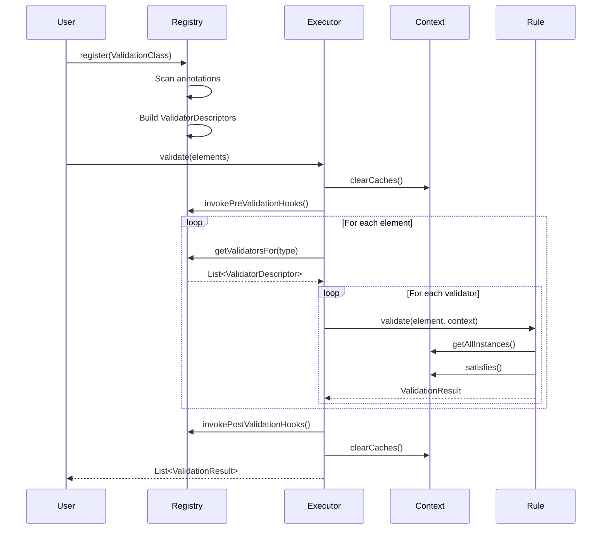

# Design: Comprehensive Validation Framework Documentation

## Change ID
`add-comprehensive-documentation`

## Overview
This design document outlines the comprehensive documentation strategy for the Judo Zeta Validation Framework, including structure, content organization, EVL comparison approach, and example integration.

## Design Goals
1. **Progressive Disclosure** - Start simple, layer in complexity
2. **Developer-Friendly** - Clear examples, practical guidance
3. **EVL Bridge** - Help EVL users transition smoothly
4. **Real-World Focus** - Use actual judo-meta-esm patterns
5. **Visual Learning** - Leverage diagrams for complex concepts
6. **Maintainability** - Keep docs close to code, linkable examples

## Architecture Decisions

### AD-1: Documentation in Git Repository vs External Wiki

**Decision**: Keep documentation in `docs/` directory within the git repository

**Rationale**:
- **Version alignment**: Docs stay in sync with code versions
- **Review process**: Documentation changes go through PR review
- **Offline access**: Developers can read docs without internet
- **Search integration**: IDE and grep can find documentation
- **Branching**: Feature branches can update docs alongside code

**Alternatives Considered**:
- External wiki (Confluence, GitHub Wiki) - rejected due to version drift
- Separate documentation repository - rejected due to synchronization complexity

### AD-2: Markdown Format vs AsciiDoc vs ReStructuredText

**Decision**: Use Markdown with Mermaid for diagrams

**Rationale**:
- **Universal support**: GitHub, IDEs, static site generators all support Markdown
- **Simple syntax**: Easy to write and read
- **Mermaid integration**: Excellent diagram support with text-based syntax
- **Tooling**: Extensive tooling ecosystem (linters, converters, generators)
- **Familiarity**: Most developers know Markdown

**Alternatives Considered**:
- AsciiDoc - more powerful but steeper learning curve
- ReStructuredText - excellent for Python docs but less universal
- HTML - too verbose for maintenance

### AD-3: EVL Comparison Approach

**Decision**: Create dedicated EVL comparison section with side-by-side examples

**Rationale**:
- **Target audience**: Many users come from EVL background
- **Clear migration path**: Explicit syntax mapping reduces confusion
- **Feature transparency**: Show what's supported and what's not
- **Learning accelerator**: Leverage existing EVL knowledge

**Structure**:
```
evl-comparison/
├── overview.md          # Philosophy and high-level differences
├── syntax-mapping.md    # EVL construct → Zeta equivalent
├── migration-guide.md   # Step-by-step migration process
└── feature-parity.md    # What's supported/missing
```

**Example Format**:
```markdown
## Constraint Definition

### EVL
```evl
context EntityType {
    constraint MustHaveName {
        check: self.name.isDefined()
        message: "Entity must have name"
    }
}
```

### Zeta Validation
```java
@ValidationContext(EntityType.class)
public class EntityValidations {
    @Constraint(name = "MustHaveName", message = "Entity must have name")
    public ValidationRule mustHaveName() {
        return (element, ctx) -> {
            EntityType entity = (EntityType) element;
            return entity.getName() != null
                ? ValidationResult.pass()
                : ValidationResult.fail("Entity must have name");
        };
    }
}
```
```

### AD-4: Example Integration Strategy

**Decision**: Use inline code examples with references to judo-meta-esm source

**Rationale**:
- **Authenticity**: Real-world patterns from production code
- **Completeness**: Show full context, not isolated snippets
- **Verification**: Examples are tested in judo-meta-esm
- **Learning**: See how professionals use the framework

**Example Sourcing Strategy**:
1. Identify representative validations in judo-meta-esm
2. Extract and simplify for documentation
3. Link to actual source file for full context
4. Create simplified test versions in documentation test suite

**Example Structure**:
```markdown
## Entity Type Name Uniqueness

This example shows how to validate entity type names are unique (case-insensitive).

**Source**: EntityTypeValidations.java in judo-meta-esm

```java
@Critique(
    name = "EntityTypeNamesAreUnique",
    message = "There are two or more entity types of the same name: {name}"
)
@Guard(method = "guardEntityTypeNamesAreUnique")
public ValidationRule entityTypeNamesAreUnique() {
    return (element, ctx) -> {
        EntityType self = (EntityType) element;
        Collection<EntityType> allEntityTypes = ctx.getAllInstances(EntityType.class);
        
        boolean hasDuplicate = allEntityTypes.stream()
            .filter(t -> t != self)
            .anyMatch(t -> t.getName().equalsIgnoreCase(self.getName()));
        
        return hasDuplicate
            ? ValidationResult.warn("Duplicate name: " + self.getName())
            : ValidationResult.pass();
    };
}
```

**Key Points**:
- Uses `@Critique` for warning-level validation
- Guard ensures name is already validated
- Case-insensitive comparison prevents duplicates
```

### AD-5: Best Practices Organization

**Decision**: Organize best practices by pattern type, not by annotation

**Rationale**:
- **Problem-oriented**: Developers search by what they're trying to do
- **Pattern recognition**: Group related patterns together
- **Reusability**: Patterns can combine multiple annotations

**Organization**:
```
best-practices/
├── constants.md              # ConstraintNames, GuardMethodNames patterns
├── extension-delegation.md   # Static utility class pattern
├── guard-methods.md          # Guard condition patterns
├── error-messages.md         # Message formatting best practices
└── performance.md            # Caching, parallelization, optimization
```

**Pattern Format**:
```markdown
## Pattern: Constraint Name Constants

### Problem
Hard-coded constraint names lead to typos and make refactoring difficult.

### Solution
Define constraint names as constants in a central class.

### Example (from judo-meta-esm)

**ConstraintNames.java**:
```java
public final class ConstraintNames {
    public static final String ENTITY_TYPE_NAMES_ARE_UNIQUE = "EntityTypeNamesAreUnique";
    public static final String ENTITY_TYPE_HAS_MAPPING = "EntityTypeHasMapping";
    // ...
}
```

**Usage**:
```java
import static com.example.ConstraintNames.*;

@Critique(name = ENTITY_TYPE_NAMES_ARE_UNIQUE, message = "...")
public ValidationRule entityTypeNamesAreUnique() { ... }
```

### Benefits
- Compile-time error on typos
- Easy refactoring (rename constant)
- Autocomplete support in IDE
- Centralized naming convention

### Related Patterns
- Guard Method Name Constants
- Error Message Templates
```

### AD-6: Diagram Strategy

**Decision**: Use Mermaid for all diagrams embedded in Markdown

**Rationale**:
- **Text-based**: Easy to version control and review
- **GitHub rendering**: Native support in GitHub Markdown
- **Maintainability**: Easier to update than binary image files
- **Consistency**: Unified diagram style across documentation
- **Tooling**: Many tools support Mermaid (VS Code, IntelliJ, etc.)

**Diagram Types**:
1. **Component Diagram** - System architecture overview
2. **Sequence Diagram** - Validation execution flow
3. **Activity Diagram** - Parallel execution work distribution
4. **Graph Diagram** - Dependency resolution examples
5. **Flowchart** - Decision trees for troubleshooting

**Example Diagram**:


### AD-7: Navigation Structure

**Decision**: Hub-and-spoke navigation with bidirectional links

**Rationale**:
- **Central hub**: docs/index.md provides overview and navigation
- **Section hubs**: Each directory has its own index
- **Breadcrumbs**: Each page links back to parent hub
- **Cross-references**: Related topics link to each other
- **Progressive**: Users can dive deeper from any starting point

**Navigation Pattern**:
```markdown
# Page Title

**Navigation**: [Documentation Hub](../index.md) > [Section](index.md) > Page Title

[Content...]

## Related Topics
- [Related Topic 1](../other-section/topic1.md)
- [Related Topic 2](topic2.md)

---
**Previous**: [Previous Topic](previous.md) | **Next**: [Next Topic](next.md)
```

## Content Strategy

### Target Audiences
1. **New Users** - Never used validation framework before
2. **EVL Users** - Migrating from Epsilon Validation Language
3. **Advanced Users** - Need performance tuning and advanced patterns
4. **Maintainers** - Understanding architecture and internals

### Content Layers
```
Layer 1: Getting Started (New Users)
  └─> Installation, first example, basic concepts

Layer 2: User Guide (All Users)
  └─> Annotations, rules, guards, caching, extensions

Layer 3: Best Practices (Intermediate Users)
  └─> Patterns, conventions, performance tips

Layer 4: EVL Comparison (EVL Migrants)
  └─> Syntax mapping, migration guide, feature parity

Layer 5: Examples (Learning by Doing)
  └─> Real-world validations from judo-meta-esm

Layer 6: Architecture (Advanced/Maintainers)
  └─> Internals, execution flow, algorithms

Layer 7: Reference (API Documentation)
  └─> Complete annotation and API reference
```

### Writing Style Guidelines
- **Active voice**: "Use @Constraint to define rules" not "Rules are defined with @Constraint"
- **Second person**: "You can cache results" not "One can cache results"
- **Short paragraphs**: 3-5 sentences maximum
- **Code-first**: Show example before explaining
- **Practical**: Focus on "how" and "why", not just "what"

## Example Source Analysis

### judo-meta-esm Validation Patterns

Based on analysis of judo-meta-esm validation rules, key patterns include:

1. **Constant-Based Naming**
   - `ConstraintNames.java`: Centralized constraint name constants
   - `GuardMethodNames.java`: Guard method name constants
   - Benefits: Type safety, refactoring support, IDE autocomplete

2. **Static Extension Delegation**
   - `EsmUtils.java`: Static utility methods for complex operations
   - Used for: Inheritance traversal, binding resolution, compatibility checks
   - Pattern: Delegate complex logic to static helpers

3. **Instance Extension Methods**
   - `EntityTypeExtensions.java`: Instance methods on model elements
   - Used for: Element-specific helpers, cached computations
   - Pattern: Annotate with @ExtensionMethod, call from validation rules

4. **Guard Method Patterns**
   - Method-level guards for conditional validation
   - Common guards: "satisfies prerequisite constraint", "element has container", "is specific type"
   - Pattern: Guard method returns boolean, named with "guard" prefix

5. **Complex Dependency Chains**
   - Operation validations show deep @Satisfies chains
   - Example: AbstractOperationIsValid → OverridingAbstractOperationWithValidParameters
   - Pattern: Build validation layers, each assuming previous layer passed

6. **Message Interpolation**
   - Messages include element context: "Entity type: {name} must..."
   - Java concatenation: `"Entity type: " + self.getName() + " must..."`
   - Pattern: Include element identifier in error messages

### Example Coverage Plan

Minimum 15 examples from judo-meta-esm:

1. **Simple Examples** (3)
   - Basic constraint (name not null)
   - Simple critique (should have description)
   - Guard condition (only validate if abstract)

2. **Entity Type Validations** (3)
   - Name uniqueness (case-insensitive)
   - Mapping validation
   - Abstract operation requirements

3. **Operation Validations** (4)
   - Abstract operation validations
   - Instance operation validations
   - Mapped operation validations
   - Override parameter compatibility

4. **Inheritance Validations** (2)
   - Cyclic inheritance detection
   - Supertype validation propagation

5. **Cross-Reference Validations** (3)
   - Transfer Object binding validation
   - Reference cardinality checks
   - Multi-element consistency checks

## Technical Implementation Notes

### Code Example Testing
- Extract code examples to `docs/examples/src/test/java/`
- Run as part of build: `mvn test -Ptest-docs-examples`
- Ensures examples stay current with API changes

### Link Validation
- Use `markdown-link-check` in CI
- Fail build on broken internal links
- Warn on broken external links

### Diagram Rendering
- GitHub natively renders Mermaid
- For PDF/offline: Use mermaid-cli to pre-render
- Include both source and rendered versions

### Search Integration
- Use frontmatter for metadata
- Support static site generators (Jekyll, MkDocs)
- Enable full-text search if hosted

## Risks and Mitigations

| Risk | Mitigation |
|------|-----------|
| Documentation outdated | Link to code, automated example testing |
| EVL comparison inaccurate | Review with EVL experts, cite versions |
| Examples too complex | Start simple, layer complexity |
| Diagrams don't render | Test rendering in GitHub before commit |
| Overwhelming for beginners | Clear navigation, progressive disclosure |

## Future Enhancements

Not in scope for this change, but consider later:
- Interactive playground (Jupyter notebooks)
- Video tutorial series
- Cheat sheet PDF
- Translation to other languages
- Integration with JavaDoc

## Success Metrics

Documentation quality metrics:
- **Completeness**: All planned sections written
- **Accuracy**: 0 broken links, all examples compile
- **Coverage**: 15+ judo-meta-esm examples, 5+ diagrams
- **Usability**: 2+ peer reviews pass
- **Discoverability**: README references docs clearly
